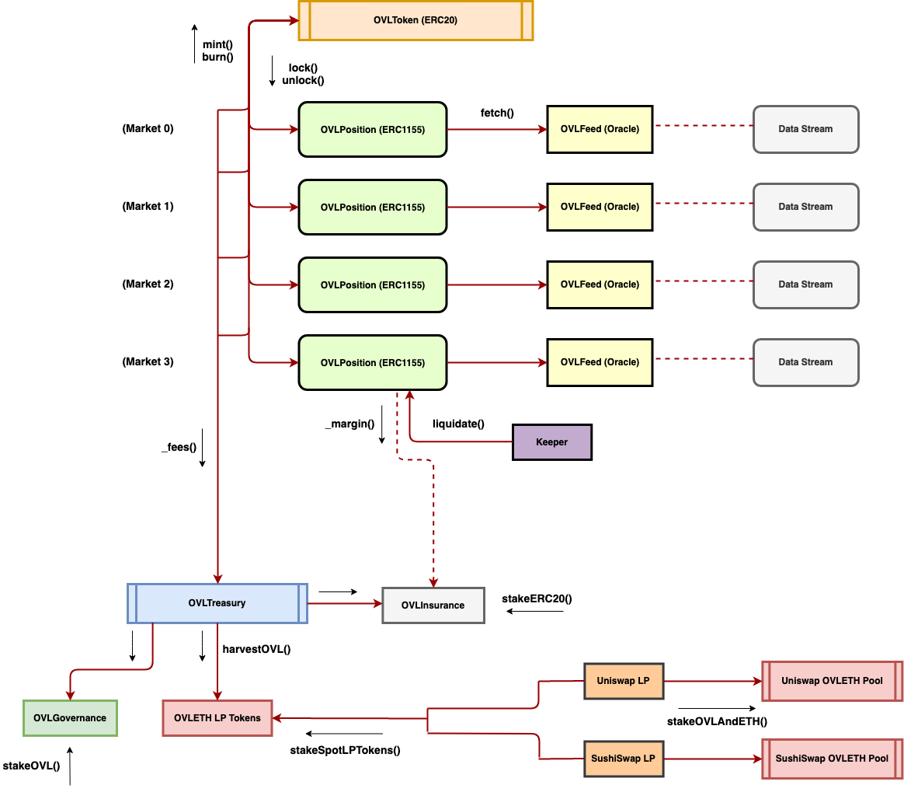

## Simple Summary
<!--"If you can't explain it simply, you don't understand it well enough." Simply describe the outcome the proposed changes intends to achieve. This should be non-technical and accessible to a casual community member.-->
Provides incentives for core supporters of the protocol via pass-through trading fees. Floats the market price for all feeds offered to enable price discovery.

## Abstract
<!--A short (~200 word) description of the proposed change, the abstract should clearly describe the proposed change. This is what *will* be done if the OIP is implemented, not *why* it should be done or *how* it will be done. If the OIP proposes deploying a new contract, write, "we propose to deploy a new contract that will do x".-->
Updates to the monetary policy and pricing model for each Overlay-offered market are suggested to attempt to ensure the long-term stability and robustness of the system. Pricing of each trading position entered or exited on a market would be determined by a constant function market maker (CFMM) with periodic minting and burning to track the underlying oracle feed. To incentivize liquidity for OVL, a portion of protocol trading fees would be allocated to spot market liquidity providers through a community governed treasury. We also propose an incentivized insurance fund as a fail-safe to curb excessive expansion of the OVL currency supply.

## Motivation
<!--This is the problem statement. This is the *why* of the OIP. It should clearly explain *why* the current state of the protocol is inadequate.  It is critical that you explain *why* the change is needed, if the OIP proposes changing how something is calculated, you must address *why* the current calculation is innaccurate or wrong. This is not the place to describe how the OIP will address the issue!-->
To recap, the Overlay protocol offers users the ability to trade scalar, non-manipulable and unpredictable data streams. For v1, we focus on DeFi price feeds.

The Overlay mechanism is relatively simple: traders enter positions by locking up tokens native to the protocol (OVL) in long or short positions on various data streams. When a trader exits that same position, the protocol dynamically mints/burns OVL based on their net profit/loss for the trade:

\\[ \mathrm{PnL} = \mathrm{O}\_{s} \cdot (\pm)\_{s} \cdot \frac{P_{exit} - P_{entry}}{P_{entry}} \\]

where \\( \mathrm{O}_s \\) is the size in OVL of their position, \\( (\pm)\_{s} = 1 \\) for longs and \\( (\pm)\_{s} = -1 \\) for shorts, and \\( P\_{entry}, P\_{exit} \\) are entry and exit prices of the position. The contract mints/burns \\( \mathrm{PnL} \\) amount from the total existing supply of OVL (i.e., mints if \\( \mathrm{PnL} > 0 \\) and burns if \\( \mathrm{PnL} < 0 \\)) and returns \\( \mathrm{O}\_{s} + \mathrm{PnL} \\) amount of OVL tokens to the trader's address. One can think of this as the protocol fronting credits in the system to successful traders to compensate them for their profits in the hopes of eventually burning a similar amount of credits from unsuccessful traders in the future, or socializing the losses.

Prior work in [[1]](#kay-2018) had shown the potential for burning of trading fees to curb large minting shocks to the currency supply, by introducing a downward drift in supply over time. However, some key questions still remained:

- Where would spot market liquidity for the OVL token come from?

- How would the protocol handle unanticipated extreme wins that significantly increase the currency supply?

- How would the protocol prevent front-running of the oracle fetch given spot market data is usually much higher frequency than oracle-reported data?

- How would the protocol incentivize a balanced set of positions on markets?

This OIP addresses each of these concerns.

## Specification
<!--The specification should describe the syntax and semantics of any new feature, there are five sections
1. Overview
2. Rationale
3. Technical Specification
4. Test Cases
5. Configurable Values
-->

### Overview
<!--This is a high level overview of *how* the OIP will solve the problem. The overview should clearly describe how the new feature will be implemented.-->
There are a number of high level components required to implement these changes to the protocol. They are outlined below:

- [Monetary Policy](#monetary-policy)
- [Pricing Mechanism](#pricing-mechanism)
- [Liquidity Constraints](#liquidity-constraints)
- [Feeds on Launch](#feeds-on-launch)

Details are given in the following technical specification.

### Rationale
<!--This is where you explain the reasoning behind how you propose to solve the problem. Why did you propose to implement the change in this way, what were the considerations and trade-offs. The rationale fleshes out what motivated the design and why particular design decisions were made. It should describe alternate designs that were considered and related work. The rationale may also provide evidence of consensus within the community, and should discuss important objections or concerns raised during discussion.-->
Given the complexity of the design changes, the rationale and trade-offs are addressed in each component in the technical specification below.

### Technical Specification
<!--The technical specification should outline the public API of the changes proposed. That is, changes to any of the interfaces Overlay currently exposes or the creations of new ones.-->

#### Monetary Policy
Overlay's monetary policy relies on revenues from trading fees charged when a user of the protocol builds or unwinds a position on a data stream. A portion of these fees would be burned upon trade execution to help manage currency supply. The rest would be sent to a community governed treasury.

Overlay’s community governed treasury would pass through these trading fees to incentivize spot market liquidity providers (LPs), insurance fund providers, and a community operations fund as compensation for each of their services.

The following is a high-level overview for the roles of each of the core participants supporting the protocol:

- **Spot Market LPs:** enable traders to swap OVL for ETH to enter/exit the Overlay system. LPs stake their spot OVL-ETH LP tokens in the treasury contract to earn yield in OVL.

- **Governance Participants:** determine the risk/reward parameters of and markets offered by the protocol to ensure the Overlay system remains useful over time. Governance participants will vote off-chain at launch with 1:1 votes for every OVL held and 2:1 votes for every OVL-ETH LP token held.

- **Insurance Fund Providers:** backstop the protocol by locking up collateral for a governance-determined set amount of time, with an auction-and-burn mechanism in the event of any unanticipated excessive increase in the currency supply. Insurance fund providers can stake e.g., ETH, DAI, YFI, AAVE-ETH LP, OVL-ETH LP, etc. in the treasury contract to earn yield in OVL, with downside risk of collateral loss. They also receive rights to a portion of the margin from liquidated positions to compensate them for the additional risk taken.

- **Community Operations Fund:** develop the protocol (e.g. build new contracts, admin, community services) and help it grow sustainably. A portion of pass-through trading fees in OVL would be sent to this community multi-sig with governance votes determining how best to spend funds to promote the growth of the Overlay protocol and its ecosystem.

OVL would act as a governance token for all decisions to adjust the system itself, giving even more weight and "skin in the game" to successful traders and liquidity providers.

High-level implementation details are below:

And base exchange contracts:

- `OVLToken (ERC-20):` Base token with public ``mint()``, ``burn()`` functions through ``AccessControl`` privileges given to each `OVLPosition` contract. Allows holders to participate in long/short trading of data streams. Gives holders governance stake in proposed data feeds and tuning of their risk parameters. Gives holders governance control over treasury parameters: allocations of trading fee pass-through revenues.

- `OVLPosition (ERC-1155):` Represents a trader's position, received upon locking up OVL in a trade on a data stream. Unique identifiers are attributes of the position: Lock price, long/short side, leverage. Tradeable and transferrable on secondary markets given ERC-1155 standard. Liquidatable if fails to meet margin requirements, with liquidation incentives for keepers through a reward of a portion of the total OVL locked.

- `OVLFeed:` Proxy for the underlying data stream. Deployed in pair with an associated OVLPosition contract for a market offered by the protocol. Governance determines which markets and feeds to offer. Public `fetch()` function called when paying funding to positions in the `OVLPosition` contract.

The rewards for each treasury participant supporting the protocol would be rather similar, although compensation could differ depending on the role. For each treasury participant, the yield from trading fees on the associated pool of capital \\(L_{p}\\) would be given by

\\[ y_{p} = \frac{\sum_{i=1}^{N}{V_{i}} \cdot f_{i}}{L_{p}} \cdot (1-r_{b}) \cdot r_{p} \\]

where \\(\sum_{i=1}^{N}{V_{i}}\\) is the volume over all \\(N\\) markets offered by the Overlay protocol during the period between funding payments. \\(f_{i}\\) is the average trading fee during that period on market \\(i\\). \\(r_{b}\\) is the portion of trading fees that are burned to manage currency supply. \\(r_{p}\\) is the portion of pass-through trading fee revenue for the associated capital pool.

Spot market liquidity for the OVL token would be enabled by this continuous stream of Overlay trading fees to staking OVL-ETH spot LPs, as long as trading volume remains substantial enough to warrant staking. An initial liquidity mining token distribution phase would bootstrap the process. This spot market liquidity incentive creates a feedback loop to offer a price feed for OVL-ETH on the Overlay trading platform, that traders can then use to hedge out a portion of their OVL risk for their positions in other Overlay markets, given all trades are settled in OVL.

To handle unanticipated extreme wins that significantly increase the currency supply beyond the accumulated fee burn mechanism, we propose an insurance fund that is similar in nature to the Aave safety module [[2]](#aave-2020). Insurance providers stake collateral in the form of ETH, DAI, YFI, AAVE-ETH LP, OVL-ETH LP, etc. to earn yield in OVL via pass-through trading fees to the treasury. Additionally, insurance providers receive margin inflows (less keeper and burn fees) from liquidated positions on the platform, to appropriately compensate them for the significant risk taken to backstop the protocol. This insurance staked ERC-20 collateral would be locked for a set amount of time within the treasury contract.

To backstop the system in the event the currency supply increases beyond a governance-set threshold value (e.g., 20% beyond initial distribution), the treasury begins auctioning off the staked collateral in exchange for OVL at a rate of \\(n_c = (n_{OVL} / S_{OVL}) \cdot S_{c} \\) received collateral tokens for \\(n_{OVL}\\) bid OVL tokens. \\(S_{OVL}\\) is total circulating supply of OVL and \\(S_c\\) is total collateral of a particular ERC-20 token remaining in the insurance pool. The treasury then burns the received OVL tokens to drive the supply back down. The offering window remains open until the supply threshold is no longer breached either by supply burns or by governance raising the supply threshold.

These mechanisms for managing currency supply would offer alternatives to requiring a ceiling to the total supply and caps on individual trades, although it is still uncertain how supply will behave in practice. In summary, the revenue model for the protocol would be fees (in OVL) of 0.30% per trade, adjustable by governance on a feed-by-feed basis:

- 50% is burned

- 50% is sent to a community governed treasury with incentives for spot market OVL-ETH LPs and insurance fund providers

To incentivize OVL-ETH liquidity providers, insurance providers, and development within the community in perpetuity, the suggested pass-through fees to the Overlay treasury would be split at launch:

- 60.00% to OVL-ETH LPs staking

- 30.00% to ERC-20 stakers in insurance fund

- 10.00% to the community fund

The weighting factors for each actor, fee rates, and fee burn can be adjusted by governance. Further, OVL-ETH LPs can also earn \\(r_{LP} + r_{insurance} = 90\% \\) of the pass-through fee rewards plus a pro-rata share of rights to insurance fund inflows from position liquidations by additionally risking their LP collateral in the insurance fund itself. Eventually the Overlay protocol could lend out the locked OVL from positions for capital efficiency and additional revenue.

#### Pricing Mechanism
Overlay's pricing mechanism would be updated to float the current price on each market offered by the protocol. Price discovery would occur on each Overlay market separate from the underlying feed itself, and thus information associated with each trade on Overlay would enter the market price offered to traders.

This solves issues with front-running of the oracle query that would otherwise occur if one were to simply use scalars fetched directly from the oracle feed for position lock prices, as, in practice, manipulation-resistant oracles report values far less frequently than the actual spot market. As a design tradeoff, one could instead choose to queue orders prior to the next oracle update and lock queued order prices at the next oracle fetch value. However, there are significant benefits to market price discovery and the arbitrage opportunities associated with concurrently buying/selling the spot, which we shall discuss below.

For v1, the pricing curve used by each market's CFMM [[3]](#angeris-2020) will be a standard constant product formula, adopted from Uniswap: \\(\psi(R, R', \Delta, \Delta') = (R-\Delta)(R'+\Delta')\\), where \\(k=RR'\\). In contrast with two asset spot models, \\(R\\) and \\(R'\\) represent virtual OVL reserves for long and short positions on a particular market, with reserve values dynamically scaled (and thus constrained) by the underlying liquidity in the OVL-ETH spot market.

Because the market price offered by the Overlay protocol can now deviate from the underlying, one must include a periodic payment mechanism to incentivize convergence to the underlying value of the data stream. The time-weighted average price (TWAP) is used in the determination of these periodic payment amounts to protect the Overlay protocol against manipulation of the underlying spot and Overlay market prices [[4]](#uniswap-2020). Funding payments (i.e. difference between Overlay market price and spot price) are made between longs and shorts on each sampling of the underlying oracle feed. This mechanism effectively encourages arbitrageurs, who are also buying and selling the spot, to take the other side of any speculative trade that deviates the market price from the ref feed value, potentially balancing the set of active positions on an Overlay market.

Given the nature of the OVL token, these payments are relatively easy to accomplish, as the protocol simply mints the appropriate amount of tokens to the OVL pool on a market belonging to the shorts and burns from the longs (vice versa depending on the sign of the difference between Overlay market price and spot). Funding to be paid by a particular side, \\(\mathrm{F}_{i,s}\\), is given by

\\[ \mathrm{F}\_{i,s} = \mathrm{TWAO}\_{i, s} \cdot (\pm)\_{s} \cdot \frac{\mathrm{TWAP}\_{i} - \mathrm{TWAP}\_{spot}}{\mathrm{TWAP}_{spot}} \\]

where \\(\mathrm{TWAO}\_{i, s}\\) is the time weighted average of the aggregate position size on side \\(s\\) of an Overlay-offered market \\(i\\) over the period between successive funding payments, \\( (\pm)\_{s} = 1 \\) for longs and \\( (\pm)\_{s} = -1 \\) for shorts, \\(\mathrm{TWAP}_{spot}\\) is the TWAP fetched from the spot oracle at the sampling time (e.g., once per hour), and \\(\mathrm{TWAP}_i\\) is the TWAP of the Overlay market price \\(P_i\\) for market \\(i\\) over the same sampling time. Positions on an Overlay market track the pro-rata share of the open interest a user has on a particular side. Time lengths to average over are determined by governance whenever a new market is added to the protocol, taking into account the underlying spot liquidity of the feed.

Considerations for TWAPs to use in funding require estimating the expected amount needed to significantly influence the underlying spot price. For oracles fetching from a spot CFMM built on Uniswap V2 core, *TODO: ... partial deriv breakdown of liquidity required*

#### Liquidity Constraints

*TODO: ... dynamic k. how the protocol itself dynamically sets this to scale the system up/down to prevent large players from blowing out the currency supply prior to when the system can handle large trades*

#### Feeds on Launch

Bootstrap via liquidity mining phase, with phased transition between rewards from initial distribution and trading fee rewards from volume on the platform. Timing on this will depend on liquidity that builds in the base OVL-ETH spot pool.

Suggested market feeds to launch with:

- **WBTC-ETH:** weighted TWAP from Uniswap + SushiSwap
- **YFI-ETH:** weighted TWAP from Uniswap + SushiSwap
- **UNI-ETH:** weighted TWAP from Uniswap + SushiSwap
- **SUSHI-ETH:** weighted TWAP from Uniswap + SushiSwap
- **SNX-ETH:** weighted TWAP from Uniswap + SushiSwap
- **AAVE-ETH:** weighted TWAP from Uniswap + SushiSwap
- **OVL-ETH:** weighted TWAP from Uniswap + SushiSwap

*TODO: Guidelines for feeds to launch with. Underlying liquidity amount?*

*NOTE on UNI + SUSHI weighted TWAP: should be liquidity weighted ... TODO: how in a manipulation resistant manner? `getReserves()` can likely be gamed. Could always have governance control to begin with and periodically update*

### Test Cases
<!--Test cases for an implementation are mandatory for OIPs but can be included with the implementation..-->
Test cases for an implementation are mandatory for OIPs but can be included with the implementation.

### Risks

The following are some significant risks associated with this approach that need to be considered:

- Informed traders could cause excessive minting without other traders willing to take the other side of their trade (even arbitrageurs). In other words, the market knows something Overlay CFMMs won't be able to know, and there isn't another trader willing to take on the risk to balance the active positions on a market.

- Manipulation of the underlying TWAPs for funding, particularly on the OVL-ETH feed if liquidity is low or not averaged over a long enough period of time. For OVL-ETH, there are freshness concerns associated with price sensitivity constants that need to be balanced here (~ 1 hour TWAP would be ideal).

- Multiple breaches of the insurance fund threshold leading to an unwillingness from insurance providers to stake collateral. Burns of margin would still be possible here to attempt to stabilize the currency supply over time, but likely not enough.

- Lack of trading volume on the platform causing insignificant rewards for OVL-ETH spot liquidity providers to compensate them for their role in the system. Potentially causes a run on the system in anticipation of the liquidity entry/exit way into and out of the platform drying up. This could happen due to a number of reasons including an unwillingness to settle in OVL (versus e.g., ETH).

## Acknowledgments
Daniel Wasserman (@dwasse) for the insurance fund's collateralization and auction mechanisms, and Cam Harvey for comments, edits, and review.

## References
<a id="kay-2018">[1]</a> Adam Kay. *Overlay*. URL: [http://overlay.market/pdfs/WPv3.pdf](http://overlay.market/pdfs/WPv3.pdf).

<a id="aave-2020">[2]</a> Aavenomics: *Safety Module.* URL: [https://docs.aave.com/aavenomics/safety-module](https://docs.aave.com/aavenomics/safety-module).

<a id="angeris-2020">[3]</a> Guillermo  Angeris,  Alex  Evans,  and  Tarun  Chitra. *When  does  the  tailwag  the  dog?  Curvature  and  market  making.*  2020. [arXiv:2012.08040 [q-fin.TR]](https://arxiv.org/abs/2012.08040)

<a id="uniswap-2020">[4]</a> Hayden Adams, Noah Zinsmeister, and Dan Robinson. *Uniswap v2 Core.* URL: [https://uniswap.org/whitepaper.pdf](https://uniswap.org/whitepaper.pdf)

## Copyright
Copyright and related rights waived via [CC0](https://creativecommons.org/publicdomain/zero/1.0/).
