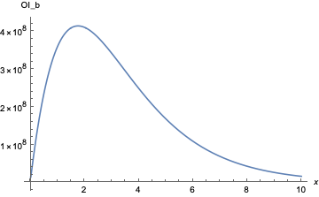
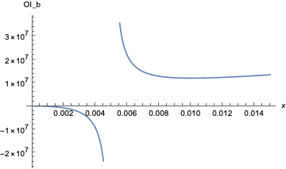
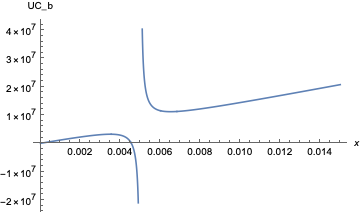
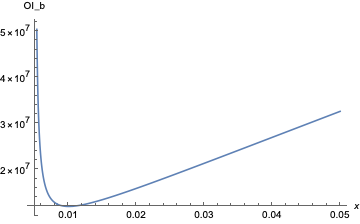
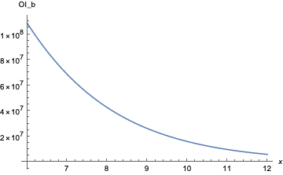
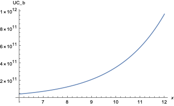

Two issues to address with this note:

- What is the cost to attack an Overlay market that uses Balancer V2 price oracles, if the attacker manipulates the spot pool?

- How do we prevent this type of spot manipulation attack?

## Context

Balancer V2 is the only existing AMM that offers *both* historical snapshots of price and liquidity accumulator values queryable on-chain and a deterministic liquidity profile. The combination of these two makes it possible for us to offer a reliable market on their geometric TWAP oracles, as we can use the liquidity oracle to adjust our open interest caps such that the spot manipulation position is not profitable.

What I'll call the backrunning position works like so:

1. Alice takes out an Overlay position on the Balancer V2 TWAP feed
2. Alice swaps tokens through the spot pool for \\( \nu \\) blocks to increase/decrease price in her Overlay position's favor
3. Alice exits the Overlay position

Total profit for the attack is the gain obtained from the Overlay position less the loss to slippage from the swaps on spot.

My prior note examining [cost of attack for Uniswap V2 TWAPs](note-2) incorrectly assumed that the attacker loses all capital used to swap on spot for the manipulation. In reality, the attacker only loses to slippage as they receive tokens out from the spot pool. The difference in capital required to execute the attack becomes apparent when the attacker manipulates the pool over multiple blocks within the averaging window (little is lost to slippage) vs over just one block (most is lost to slippage).

I'll use this note for a more proper derivation of cost of attack and an implementable, via our market contracts, mitigation strategy to make this attack unprofitable in all reasonable instances.

## Balancer Math

From the [Balancer whitepaper](https://balancer.fi/whitepaper.pdf), the invariant \\( V \\) for each spot pool is

\\[ V = \prod_{k} B_k^{w_k} \\]

where

- \\( B_k \\) is the number of \\( k \\) type tokens in the pool
- \\( w_k \\) is the weight for \\( k \\) type tokens in the pool
- \\( \sum_k w_k = 1 \\)

The spot price inferred from the relative number of tokens in the pool is

\\[ SP_i^o = \frac{B_i}{B_o} \cdot \frac{w_o}{w_i} \\]

with \\( i \\) type tokens as the quote and \\( o \\) type tokens as the base currency.

The number of quote tokens \\( A_i \\) need to swap into the pool to move the price from \\( SP^o_i \to SP^{\prime o}_i \\) and the number of base tokens \\( A_o \\) received out from said swap are found to be

\\[ A_i = B_i \cdot \bigg[ \bigg( \frac{SP^{\prime o}_i }{SP^o_i} \bigg)^{\frac{w_o}{w_o+w_i}} - 1 \bigg] \\]
\\[ A_o = B_o \cdot \bigg[ 1 - \bigg( \frac{SP^{\prime o}_i }{SP^o_i} \bigg)^{-\frac{w_i}{w_o+w_i}} \bigg] \\]

The Balancer oracle reports the geometric TWAP

\\[ \mathrm{TWAP}\_i^o(t_1, t_2) = \bigg( \prod_{k=t_1}^{t_2} SP_i^o(k) \bigg)^{\frac{1}{t_2-t_1}} \\]

given the accumulator value is stored as the sum of the logarithm of price.

## Overlay Math

For a user that takes out a position with open interest \\( \mathrm{OI} \\) at an entry price of \\( P(i) \\), their position's PnL is

\\[ \mathrm{PnL}(t) = \pm \mathrm{OI} \cdot \bigg[ \frac{P(t)}{P(i)} - 1 \bigg] \\]

where \\( \pm = +1 \\) if long and \\( \pm = -1 \\) if short. The open interest attributed to a position at entry is

\\[ \mathrm{OI} = N \cdot L \\]

for a collateral amount deposited \\( N \\) and a leverage choice \\( L \\). The debt the user owes to the system is \\( D = N \cdot (L - 1) \\). We ignore funding payments for this note.

To combat a positionr who attempts to front-run the information lag inherent in the manipulation-resistant oracle value used by the Overlay market vs the "real" spot value, we added a [bid-ask spread and market impact](note-8) to all positions on the platform. The Overlay market price ratio \\( P(t) / P(i) \\) effectively becomes

\\[ \frac{P(t)}{P(i)} = e^{x \mp 2\delta } \\]

where

- \\( \delta \\) is a static spread
- \\( \mp = -1 \\) for longs and \\( \mp = +1 \\) for shorts
- \\( e^x \\) is the price ratio between the final and initial TWAP values

The positionr pays an upfront impact fee on position size, but for a position built up over a long enough time horizon (e.g. effectively "TWAPing" in), this fee can trend to zero.

## Backrunning Trade

### Summary

Enforcing an upper bound on the Overlay market's open interest cap of

\\[ C_Q \leq \Delta \cdot B_i \cdot \frac{w_o}{w_o + w_i} \cdot 4\delta \\]

makes the backrunning position unprofitable in all reasonable cases.

### Setup

For the backrunning position, we assume

- Market impact fees are zero, taking the limit of a positionr slowly entering into their Overlay position prior to manipulating spot
- Trading fees are zero and ignore gas costs
- Arbitrageurs bring the spot price on Balancer back from \\( SP^{\prime o}_i \to SP^o_i \\) at the beginning of each successive block, after the accumulator registers the manipulated price \\( SP^{\prime o}_i \\)
- Overlay market feed uses the Balancer geometric TWAP averaged over the last \\( \Delta \\) blocks

The attacker enters a position on Overlay. They then manipulate the spot price from \\( SP^o_i \to SP^{\prime o}_i \\) for \\( \nu \\) successive blocks. They finally exit the Overlay position.

To profitably execute the attack, the attacker must overcome the static spread applied to entry and exit prices on the Overlay position. PnL for the attack is

\\[ \mathrm{PnL}\_{\textrm{attack}} = \mathrm{PnL}\_{\textrm{Overlay}} + \mathrm{Slippage}\_{i \to o} \\]

where

- \\( \mathrm{PnL}\_{\textrm{Overlay}} \\) is the profit from the Overlay leg of the position
- \\( \mathrm{Slippage}\_{i \to o} \\) are the funds lost to slippage on the spot leg

As we assume arbitrageurs bring the spot price back each block, the value of the tokens received by the attacker from the spot pool will be \\( SP^o_i A_o \\). Thus, the capital lost to slippage is

$$\begin{eqnarray}
\mathrm{Slippage}_{i \to o} &=& \nu \cdot (SP^o_i A_o - A_i) \\
&=& - \nu B_i \cdot \bigg\{ \bigg( \frac{SP^{\prime o}_i }{SP^o_i} \bigg)^{\frac{w_o}{w_o+w_i}} - 1 - \frac{w_o}{w_i} \cdot \bigg[ 1 - \bigg( \frac{SP^{\prime o}_i }{SP^o_i} \bigg)^{-\frac{w_i}{w_o+w_i}} \bigg] \bigg\}
\end{eqnarray}$$

having manipulated for \\( \nu \\) blocks.

Assume the attacker takes a long position on Overlay and manipulates spot price upward (same results will hold for the short). Profits from the Overlay leg of the position will be

\\[ \mathrm{PnL}\_{\textrm{Overlay}} = \mathrm{OI} \cdot \bigg[ e^{x - 2\delta} - 1 \bigg] \\]

Let

\\[ \frac{SP^{\prime o}_i}{SP^o_i} \equiv e^{x\_{sp}} \\]

where \\( SP^{\prime o}_i \\) is registered in the accumulator over the last \\( \nu \\) blocks and the prior \\( \Delta - \nu \\) blocks of the TWAP averaging window registered \\( SP^o_i \\). A bit of algebra with the geometric TWAP yields

$$\begin{eqnarray}
P(t) &=& \mathrm{TWAP}_i^o(t - \Delta, t) \\
&=& \bigg( \prod_{k=t - \Delta}^{t-\nu} SP_i^o \cdot \prod_{k=t - \nu}^{t} SP^{\prime o}_i \bigg)^{\frac{1}{\Delta}} \\
&=& SP_i^o \cdot e^{\frac{\nu}{\Delta} \cdot x_{sp}}
\end{eqnarray}$$

When the price (and therefore TWAP) is about equal to \\( SP_i^o \\) in the \\( \Delta \\) blocks prior to manipulation, we can express the spot price change in terms of the TWAP change simply as

\\[ e^{x\_{sp}} = e^{\frac{\Delta}{\nu} \cdot x} \\]

Our PnL for the attack in terms of \\( x \\) is

$$\begin{eqnarray}
\mathrm{PnL}_{\textrm{attack}}(x) &=& \mathrm{OI} \cdot \bigg[ e^{x - 2\delta} - 1 \bigg] - \nu B_i \cdot \bigg\{ e^{\frac{\Delta}{\nu} \cdot \frac{w_o}{w_o+w_i} \cdot x} - 1 - \frac{w_o}{w_i} \cdot \bigg[ 1 - e^{- \frac{\Delta}{\nu} \cdot \frac{w_i}{w_o+w_i} \cdot x} \bigg] \bigg\}
\end{eqnarray}$$

## Break-Even Values

To overcome slippage and net an overall PnL for the attack greater than zero, the positionr must have entered into an Overlay position with OI larger than

\\[ \mathrm{OI}_B (x) = \nu B_i \cdot \frac{e^{\frac{\Delta}{\nu} \cdot \frac{w_o}{w_o+w_i} \cdot x} - 1 - \frac{w_o}{w_i} \cdot \bigg[ 1 - e^{- \frac{\Delta}{\nu} \cdot \frac{w_i}{w_o+w_i} \cdot x} \bigg]}{e^{x-2\delta} - 1} \\]

Any amount of open interest on the Overlay leg of the position larger than \\( \mathrm{OI}_{B} \\) yields a profitable attack for the positionr. If our open interest caps are lower than the minimum for this break-even value, it won't be possible for the attacker to enter the backrunning position profitably and thus positionrs won't have an incentive to perform the attack.

Note that capital lost to slippage, \\( \mathrm{Slippage}\_{i \to o} \\), for a given desired change to the TWAP is smallest when \\( \nu \to \Delta \\). Intuitively, it costs less to swap a small amount every block for \\( \Delta \\) blocks to manipulate the TWAP (assuming price doesn't move significantly otherwise, which is a stretch) vs attempting to manipulate the value of the TWAP all in one block. Therefore, the minimum value for \\( \mathrm{OI}_B \\) will occur when \\( \nu = \Delta \\):

\\[ \mathrm{OI}_B (x) \|\_{\nu = \Delta} = \Delta \cdot B_i \cdot \frac{e^{\frac{w_o}{w_o+w_i} \cdot x} - 1 - \frac{w_o}{w_i} \cdot \bigg[ 1 - e^{- \frac{w_i}{w_o+w_i} \cdot x} \bigg]}{e^{x-2\delta} - 1} \\]

To break-even, total upfront cost including the capital needed to manipulate spot will be

\\[ \mathrm{UC}_B (x)\|\_{\nu = \Delta} = \frac{\mathrm{OI}_B (x)\|\_{\nu = \Delta}}{L} + \Delta \cdot A_i \\]

Before examining the critical points of \\( \mathrm{OI}_B \\) for the relevant minimum, it helps to look at a few plots. For plots, take:

- \\( B_i = \$ 10 \textrm{M} \\)
- \\( \Delta = \nu = 240 \\)
- \\( w_o = w_i = \frac{1}{2} \\)
- \\( \delta = 0.0025 \\)
- \\( L = 5 \\)

Over the majority of the range of possible TWAP changes \\( x \in [4\delta, \infty) \\),

break-even open interest appears smallest when \\( x \to 0^{+} \\) and \\( x \to \infty \\) (y-axis in $). Zooming in around \\( x \in [0, 6\delta] \\), however,

shows a minimum for \\( \mathrm{OI}_b \\) occurs near \\( x = 4\delta \\). Upfront costs in these ranges of about $14M are reasonable for a well-motivated attacker to obtain. Further plotting for \\( x \in [2\delta, 20\delta] \\) highlights the local minimum:

For larger values of \\( x \\), break-even open interest matches the prior minimum around \\( x = 10 \\)

but break-even upfront costs become massive on the order of $353.8B, which is close to the entire market cap of ETH to date. Therefore, \\( x \to \infty \\) isn't a concern.

## Critical Points

The spread is what saves us from the backrunning position. This is easiest to see as \\( x \to 0^{+} \\) for different values of \\( \delta \\).

When \\( \delta = 0 \\), L'Hopital gives \\( \lim_{x \to 0^{+}} \mathrm{OI}_B = 0 \\) and we lose the infinite behavior around \\( x = 2\delta \\). Cost of attack is effectively zero for small enough price changes. Yet when \\( \delta > 0 \\), we have infinite behavior around \\( x = 2\delta \\), and there doesn't exist a positive break-even open interest that makes the position profitable as \\( x \to 0^{+} \\).

From the plots, it appears that \\( x = 4\delta \\) is likely to be our critical value for which break-even open interest is at a minimum. Below, we derive this to \\( \mathcal{O}(x^2) \\), assuming \\( x \\) is of similar order to \\( \delta \\) for the ranges we care to protect against.

Critical points \\( x_c \\) occur for

\\[ \frac{d\mathrm{OI}_B}{dx}\bigg\|\_{x = x_c} = 0 \\]

With a bit of work, I find

$$\begin{eqnarray}
\frac{d\mathrm{OI}_B}{dx} = \frac{\Delta \cdot B_i}{(e^{x - 2\delta} - 1)^2} \cdot \bigg\{ (e^{x - 2\delta} - 1) \cdot \frac{w_o}{w_o + w_i} \cdot \bigg[ e^{\frac{w_o}{w_o+w_i} \cdot x} - e^{-\frac{w_i}{w_o+w_i} \cdot x} \bigg] \\
- e^{x - 2\delta} \cdot \bigg[ e^{\frac{w_o}{w_o+w_i} \cdot x} - 1 - \frac{w_o}{w_i} \cdot \bigg( 1 - e^{- \frac{w_i}{w_o+w_i} \cdot x} \bigg) \bigg] \bigg\}
\end{eqnarray}$$

which is zero when

$$\begin{eqnarray}
0 = \bigg\{ (e^{x - 2\delta} - 1) \cdot \frac{w_o}{w_o + w_i} \cdot \bigg[ e^{\frac{w_o}{w_o+w_i} \cdot x} - e^{-\frac{w_i}{w_o+w_i} \cdot x} \bigg] \\
- e^{x - 2\delta} \cdot \bigg[ e^{\frac{w_o}{w_o+w_i} \cdot x} - 1 - \frac{w_o}{w_i} \cdot \bigg( 1 - e^{- \frac{w_i}{w_o+w_i} \cdot x} \bigg) \bigg] \bigg\} \bigg|_{x=x_c}
\end{eqnarray}$$

Expanding to second order in \\( x \\) and \\( \delta \\),

\\[ e^{x-2\delta} - 1 = (x-2\delta) \cdot \bigg[ 1 + \frac{1}{2} \cdot (x - 2\delta) \bigg] + \mathcal{O}(x^3) \\]
\\[ e^{\frac{w_o}{w_o + w_i} \cdot x} - e^{- \frac{w_i}{w_o + w_i} \cdot x} = x \cdot \bigg[ 1 + \frac{1}{2} \cdot x \cdot \frac{w_o^2 + w_i^2}{(w_o + w_i)^2} \bigg] + \mathcal{O}(x^3) \\]
\\[ e^{\frac{w_o}{w_o+w_i} \cdot x} - 1 - \frac{w_o}{w_i} \cdot \bigg( 1 - e^{- \frac{w_i}{w_o+w_i} \cdot x} \bigg) = \frac{w_o}{w_o + w_i} \cdot \frac{x^2}{2} + \mathcal{O}(x^3) \\]

I get roots

\\[ 0 = x_c \cdot ( \frac{x_c}{2} - 2\delta ) + \mathcal{O}(x^3) \\]

for critical points \\( x_c \\) of order \\( \delta \\). Or

\\[ x_c = \\{ 0, 4\delta \\} \\]

Plugging in for \\( \mathrm{OI}_B (x = x_c) \\) when \\( x_c = 4\delta \\), we have a minimum for the break-even open interest at the critical value of concern:

\\[ \mathrm{OI}_B (x=4\delta)\|\_{\nu = \Delta} \approx \Delta \cdot B_i \cdot \frac{w_o}{w_o + w_i} \cdot 4\delta \\]

This places an upper bound on the Overlay market open interest cap of

\\[ C_{Q} \leq \Delta \cdot B_i \cdot \frac{w_o}{w_o + w_i} \cdot 4\delta \\]

to prevent the backrunning position from being profitable. Using Balancer's liquidity oracle, our market contracts can obtain a relatively accurate value for the time-weighted average of \\( B_i \\) to enforce this check.

Going through a similar exercise with the short Overlay position, I find \\( x_c = \\{ 0, -4\delta \\} \\) and a similar expression for \\( \mathrm{OI}_B (x = x_c) \\) at \\( -4\delta \\) but with weights interchanged. Choosing the smaller weight as the upper bound prevents the backrunning position from being profitable in either case.
