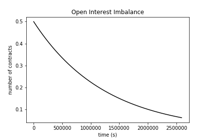
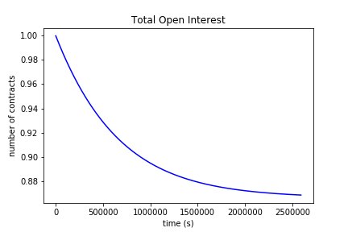
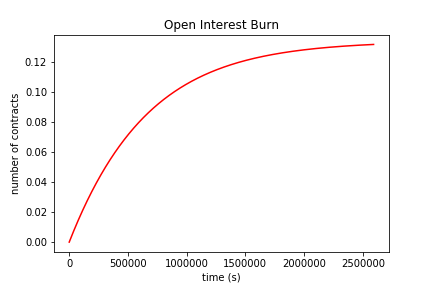
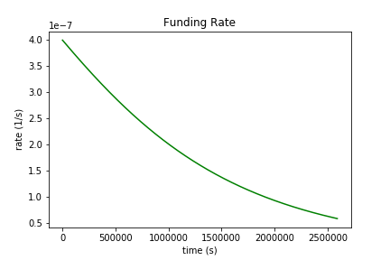

This note aims to address the following issues with [funding](note-4) raised by Mikhail:

- How should we think about our [market exposure](https://hackmd.io/@abdk/ry_09yFut) for risk estimation purposes? And what quantity (associated with market exposure) are we looking to minimize over time through funding?

- When an imbalance exists between longs and shorts, the protocol takes market risk [without being compensated for the risk](https://hackmd.io/@abdk/HydvIc4FY). How can we rethink funding such that the protocol is "compensated" for the imbalance risk it assumes?

## Notation

I've been a bit loose with my definitions in prior notes, particularly with respect to open interest. I'll clean it up here. There are two quantities of interest we care about when determining the value of an Overlay position. They are:

- Open interest: \\( \mathrm{OI} \\)
- Position size (notional): \\( Q \\)

Up until now, I've been taking the open interest of the position to be equivalent to the size of the position in OVL terms. This isn't technically right.

Instead, when an Overlay position is built by a user at time \\( t \\), define the notional of the position to be

\\[ Q \equiv N \cdot L \\]

where \\( N \\) is the initial collateral in OVL backing the position and \\( L \\) is the chosen initial leverage. \\( Q \\) is in units of OVL. Now, let the open interest associated with this position be the *number of contracts* the user entered into, where the number of contracts for a position is given by

\\[ \mathrm{OI} \equiv \frac{Q}{P} \\]

\\( P \\) is the entry price of the position fetched from the feed at time \\( t \\) when the position is built.

## Market Exposure

### Context

In prior notes, we assumed the PnL associated with a position is given by

\\[ \mathrm{PnL}(t+\tau) = \pm Q \cdot \bigg[ \frac{P(t+\tau)}{P(t)} - 1 \bigg] \\]

at some time \\( t+\tau \\), where \\( \pm = +1 \\) when the position is long and \\( \pm = -1 \\) when short.

One can understand the first issue issue to be addressed by this note through the following example.

Assume there are two users. Both initially enter the market at the same time \\( t_0 \\) with the same position size in OVL terms \\( Q_{l} = Q_{s} = Q \\) and same entry price \\( P = P(t_0) \\). Their positions perfectly balance each other, as the PnL exposure the protocol assumes on each side is

\\[ \mathrm{PnL}\_{l}\|\_{t_0 \leq t \leq t_1} = Q \cdot \bigg[ \frac{P(t)}{P(t_0)} - 1 \bigg] \\]
\\[ \mathrm{PnL}\_{s}\|\_{t_0 \leq t \leq t_1} = Q \cdot \bigg[ 1- \frac{P(t)}{P(t_0)} \bigg] \\]

such that the total exposure is zero: \\( \mathrm{PnL}\|\_{t_0 \leq t \leq t_1} = \mathrm{PnL}\_{l} + \mathrm{PnL}\_{s} = 0 \\).

The long user then exits their position at \\( t_1 \\) while the short remains. The protocol realizes the long PnL through a mint or a burn. Another user then enters a long position with the same notional position size as the last to *rebalance the position size* on the market, but with a different entry price \\( P(t_1) \\). Including the realized profits, PnL exposure after \\( t_1 \\) becomes

\\[ \mathrm{PnL}\_{l}\|\_{t \geq t_1} = Q \cdot \bigg[ \frac{P(t_1)}{P(t_0)} - 1 \bigg] + Q \cdot \bigg[ \frac{P(t)}{P(t_1)} - 1 \bigg] \\]
\\[ \mathrm{PnL}\_{s}\|\_{t \geq t_1} = Q \cdot \bigg[ 1- \frac{P(t)}{P(t_0)} \bigg] \\]

such that the total exposure the protocol assumes is: \\( \mathrm{PnL}\|\_{t \geq t_1} = \mathrm{PnL}\_{l} + \mathrm{PnL}\_{s} = Q \cdot [\frac{P(t_1)}{P(t_0)} - 1 + \frac{P(t)}{P(t_1)} \cdot (1 - \frac{P(t_1)}{P(t_0)})] \\).

This is non-zero even though another user immediately re-enters on the long side at \\( t_1 \\) to rebalance the position size on the market. This is due to the difference in entry prices between positions built at \\( t_0 \\) versus the one built at \\( t_1 \\).

If we use funding to incentivize position size be balanced between longs and shorts on a market, the protocol will continuously accumulate exposure due to the difference in entry prices for each position.

### Proposed Solution

If we instead incentivize balance in the number of contracts on each side, we eliminate the issue. Assuming OVL collateral \\( N \\) staked to back a position with initial leverage \\( L \\) and entry price \\( P(t) \\) when building the position at time \\( t \\), express the PnL of the position as

\\[ \mathrm{PnL}(t+\tau) = \pm \mathrm{OI} \cdot [P(t+\tau) - P(t)] \\]

where the open interest associated with the position is the number of contracts entered into at build: \\( \mathrm{OI} = \frac{Q}{P(t)} \\).

Returning to the prior example, PnL exposure after both users enter at \\( t_0 \\) with the same position size \\( Q_0 \\) and number of contracts \\( \mathrm{OI} = \frac{Q_0}{P(t_0)} \\) is

\\[ \mathrm{PnL}\_{l}\|\_{t_0 \leq t \leq t_1} = \mathrm{OI} \cdot \bigg[ P(t) - P(t_0) \bigg] \\]
\\[ \mathrm{PnL}\_{s}\|\_{t_0 \leq t \leq t_1} = \mathrm{OI} \cdot \bigg[ P(t_0) - P(t) \bigg] \\]

such that total exposure before the unwind is still zero: \\( \mathrm{PnL}\|\_{t_0 \leq t \leq t_1} = \mathrm{PnL}\_{l} + \mathrm{PnL}\_{s} = 0 \\).

At \\( t_1 \\) the long exits and re-enters again, this time with different position size \\( Q_1 \\) but the same *number of contracts* \\( \mathrm{OI} = \frac{Q_1}{P(t_1)} \\). Including the realized profits, PnL exposure after \\( t_1 \\) becomes

\\[ \mathrm{PnL}\_{l}\|\_{t \geq t_1} = \mathrm{OI} \cdot \bigg[ P(t_1) - P(t_0) \bigg] + \mathrm{OI} \cdot \bigg[ P(t) - P(t_1) \bigg] \\]
\\[ \mathrm{PnL}\_{s}\|\_{t \geq t_1} = \mathrm{OI} \cdot \bigg[ P(t_0) - P(t) \bigg] \\]

such that the total exposure the protocol assumes remains zero: \\( \mathrm{PnL}\|\_{t \geq t_1} = \mathrm{PnL}\_{l} + \mathrm{PnL}\_{s} = 0 \\).

If we use funding to incentivize number of contracts be balanced between longs and shorts on a market instead of position size, we solve the issue with differing entry prices.

### Imbalance in Number of Contracts

What is the exposure the protocol now assumes when the number of contracts remain imbalanced for a period of time?

Instead of the long user exiting all of their contracts like in the prior example, assume they exit a portion \\( a \cdot \mathrm{OI} \\) of their contracts at \\( t_1 \\) and re-enter with another \\( a \cdot \mathrm{OI} \\) contracts at a later time \\( t_2 \\). The open interest is \\( (1-a) \cdot \mathrm{OI} \\) on the long side and \\( \mathrm{OI} \\) on the short side from \\( t_1 \leq t \leq t_2 \\).

PnL exposure after \\( t_2 \\) becomes

\\[ \mathrm{PnL}\_{l}\|\_{t \geq t_2} = (1-a) \cdot \mathrm{OI} \cdot \bigg[ P(t) - P(t_0) \bigg] + a \cdot \mathrm{OI} \cdot \bigg[ P(t_1) - P(t_0) \bigg] + a \cdot \mathrm{OI} \cdot \bigg[ P(t) - P(t_2) \bigg] \\]
\\[ \mathrm{PnL}\_{s}\|\_{t \geq t_2} = \mathrm{OI} \cdot \bigg[ P(t_0) - P(t) \bigg] \\]

such that the total exposure the protocol assumes is the price exposure on the contract imbalance from \\( t_1 \leq t \leq t_2 \\): \\( \mathrm{PnL}\|\_{t \geq t_2} = \mathrm{PnL}\_{l} + \mathrm{PnL}\_{s} = a \cdot \mathrm{OI} \cdot [ P(t_1) - P(t_2) ] \\).

The protocol should aim to have the contract imbalance \\( \mathrm{OI}\_{imb} = \mathrm{OI}\_{l} - \mathrm{OI}\_{s} = - a \cdot \mathrm{OI} \\) from \\( t_1 \leq t \leq t_2 \\) decay toward zero through funding payments.

## Funding Burns

The second issue raised concerns the protocol acting as the counterparty to the imbalance between longs and shorts from \\( t_1 \leq t \leq t_2 \\), without actually being compensated for the risk it takes.

Assume we adopt the proposed solution above to the market exposure issues. Through funding, we look to incentivize a drawdown in contract imbalance between the long and short sides at any given time, as the protocol acts as the counterparty to this imbalance while it exists.

Using [Mikhail's example](https://hackmd.io/@abdk/HydvIc4FY), if we have 1000 OI long and 800 OI short, the protocol is effectively 200 OI short as the protocol covers the imbalance liability. In the prior implementation of funding, the entire funding payment is paid from users on the long side to users on the short side, so the protocol does not receive any payment for the risk of being 200 OI short.

A solution to this problem proposed by Mikhail would be to pay the protocol its pro-rata share of the funding payment for the exposure it takes on. In the above example, the protocol would receive and burn 20% of the funding payment sent by the longs to be compensated for its share of the short side.

### Setup

We'll explore this solution. Assume longs outweigh shorts in the derivations below, even though our expressions will be the same when the opposite is true. Additionally, assume funding payments happen continuously in time.

Given a state for the number of contracts on the long and short sides at \\( t \\), what should the state look like at \\( t+dt \\) for infinitesimally small \\( dt \\)?

As longs outweigh shorts, a funding payment should be taken from the longs and paid to the shorts, burning the protocol's pro-rata share on the short side. As \\( b(t) \equiv \frac{\|\mathrm{OI}_{imb}\|}{\mathrm{OI}\_l} \\) is the protocol's pro-rata fraction of the liability, we assume the following for the state change

$$\begin{eqnarray}
\mathrm{OI}_{l}(t+dt) - \mathrm{OI}_{l}(t) &=& - d\mathrm{FP}(t) \\
\mathrm{OI}_{s}(t+dt) - \mathrm{OI}_{s}(t) &=& [1-b(t)] \cdot d\mathrm{FP}(t) \\
\mathrm{OI}_{b}(t+dt) - \mathrm{OI}_{b}(t) &=& b(t) \cdot d\mathrm{FP}(t)
\end{eqnarray}$$

where \\( d\mathrm{FP} \\) is the funding payment paid and \\( \mathrm{OI}_b \\) is the cumulative number of contracts burned. Reframing these in terms of the total number of contracts outstanding \\( \mathrm{OI} = \mathrm{OI}\_l + \mathrm{OI}\_s \\) and the imbalance in contracts \\( \mathrm{OI}\_{imb} = \mathrm{OI}\_l - \mathrm{OI}\_s \\),

$$\begin{eqnarray}
\mathrm{OI}(t+dt) - \mathrm{OI}(t) &=& -b(t) \cdot d\mathrm{FP}(t) \\
\mathrm{OI}_{imb}(t+dt) - \mathrm{OI}_{imb}(t) &=& -[2 - b(t)] \cdot d\mathrm{FP}(t)
\end{eqnarray}$$

### Imbalance Drawdown

We can rewrite the fraction of contracts burned as \\( b(t) = \frac{2 \|\mathrm{OI}\_{imb}\|}{\mathrm{OI} + \|\mathrm{OI}\_{imb}\|} \\). This simplifies our expression for the time evolution of the imbalance to

\\[ \mathrm{OI}\_{imb}(t+dt) - \mathrm{OI}\_{imb}(t) = - \frac{2 \mathrm{OI}(t)}{\mathrm{OI}(t) + \|\mathrm{OI}\_{imb}(t)\|} \cdot d\mathrm{FP}(t) \\]

If we take the infinitesimal funding payment paid at \\( t \\) to be

\\[ d\mathrm{FP}(t) = dt \cdot \frac{\mathrm{OI}(t) + \|\mathrm{OI}\_{imb}(t)\|}{\mathrm{OI}(t)} \cdot k \cdot \mathrm{OI}\_{imb}(t) \\]

where \\( k \\) is our funding constant, then the drawdown to the contract imbalance over time simplifies to the continuous version of the original form from the [prior funding note](note-4):

\\[ d\mathrm{OI}\_{imb} = - 2k \cdot \mathrm{OI}_{imb} \cdot dt \\]

where \\( d\mathrm{OI}\_{imb} = \mathrm{OI}\_{imb} (t+dt) - \mathrm{OI}\_{imb} (t) \\). Integrating from time \\( 0 \\) to \\( t \\), the solution is

\\[ \mathrm{OI}\_{imb}(t) = \mathrm{OI}\_{imb}(0) \cdot e^{-2kt} \\]

which draws down the risk associated with an imbalance in contracts to zero over time. To first order, \\( \mathrm{OI}\_{imb}(t) = \mathrm{OI}\_{imb}(0) \cdot (1-2k)^{t} \\) which is simply the original form for the time evolution of the imbalance drawdown we used in the prior note.

### Total Contracts

We can use the imbalance in contracts to derive an expression for the time evolution in the total number of contracts. Rewriting for \\( b(t) \\),

\\[ d\mathrm{OI} = - 2k \cdot \frac{\mathrm{OI}\_{imb}^2}{\mathrm{OI}} \cdot dt  \\]

But we have an expression for \\( \mathrm{OI}_{imb}^2 \\) as a function of time from the prior section. Integrating from \\( 0 \\) to \\( t \\) with some additional simplification gives

\\[ \mathrm{OI} (t) = \mathrm{OI} (0) \cdot \sqrt{ 1 - \bigg(\frac{\mathrm{OI}_{imb}(0)}{\mathrm{OI}(0)}\bigg)^2 \cdot \bigg( 1 - e^{-4kt} \bigg) } \\]

for the total number of contracts over time as funding occurs.

Notice the limits. As \\( \mathrm{OI}\_{imb} \to 0 \\), \\( \mathrm{OI}(t) \to \mathrm{OI}(0) \\) which implies no contracts are burned (same behavior as in [our prior formulation](note-4)). However, as \\( \mathrm{OI}_{imb} \to \mathrm{OI} \\), all of funding is burned and the total number of contracts decay in the same manner as the imbalance \\( \mathrm{OI}(0) \cdot e^{-2kt} \\), which is to be expected.

Further, we don't have discontinuous behavior around the edge case of one side having zero open interest as was the case with the prior formulation, which seemed ad-hoc.

### Contracts Burned

To determine the number of contracts burned over time, we can rely on a "conservation law" for open interest through funding. We should have at all times

\\[ \mathrm{OI}(t) + \mathrm{OI}_b(t) = C \\]

for some constant \\( C \\). Intuitively, the aggregate open interest throughout the entire market system (long + short + burn) should not change through funding. As we start with zero burned contracts at time \\( 0 \\) since the last time the market was interacted with,

\\[ C = \mathrm{OI}(0) \\]

Then the time evolution of the number of contracts burned is simply

\\[ \mathrm{OI}\_b (t) = \mathrm{OI}(0) \cdot \bigg[ 1 - \sqrt{ 1 - \bigg(\frac{\mathrm{OI}_{imb}(0)}{\mathrm{OI}(0)}\bigg)^2 \cdot \bigg( 1 - e^{-4kt} \bigg) } \bigg] \\]

### Summary and Plots

We can summarize funding *with burn* in the following expressions. The time evolution of the imbalance, total contracts, and contracts burned becomes

$$\begin{eqnarray}
\mathrm{OI}_{imb}(t) &=& \mathrm{OI}_{imb}(0) \cdot e^{-2kt} \\
\mathrm{OI}(t) &=& \mathrm{OI} (0) \cdot \sqrt{ 1 - \bigg(\frac{\mathrm{OI}_{imb}(0)}{\mathrm{OI}(0)}\bigg)^2 \cdot \bigg( 1 - e^{-4kt} \bigg) } \\
\mathrm{OI}_{b}(t) &=& \mathrm{OI}(0) \cdot \bigg[ 1 - \sqrt{ 1 - \bigg(\frac{\mathrm{OI}_{imb}(0)}{\mathrm{OI}(0)}\bigg)^2 \cdot \bigg( 1 - e^{-4kt} \bigg) } \bigg]
\end{eqnarray}$$

assuming the infinitesimal funding payment should be \\( d\mathrm{FP}(t) = dt \cdot \frac{\mathrm{OI}(t) + \|\mathrm{OI}\_{imb}(t)\|}{\mathrm{OI}(t)} \cdot k \cdot \mathrm{OI}\_{imb}(t) \\).

One can use these to determine the state of the open interest on the long and short sides at any time \\( t \\) in the future with

$$\begin{eqnarray}
\mathrm{OI}_{l}(t) &=& \frac{1}{2} \cdot \bigg[ \mathrm{OI}(t) + \mathrm{OI}_{imb}(t) \bigg] \\
\mathrm{OI}_s(t) &=& \frac{1}{2} \cdot \bigg[ \mathrm{OI}(t) - \mathrm{OI}_{imb}(t) \bigg]
\end{eqnarray}$$

which is easily implementable in our smart contracts.

We can derive the rate paid and received by each party involved in funding after a bit more simplification.

$$\begin{eqnarray}
f_{l}(t) = \frac{1}{\mathrm{OI}_l} \frac{d\mathrm{OI}_l}{dt} = -2k \cdot \frac{\mathrm{OI}_{imb}(t)}{\mathrm{OI}(t)} \\
f_{s}(t) = \frac{1}{\mathrm{OI}_s} \frac{d\mathrm{OI}_s}{dt} = 2k \cdot \frac{\mathrm{OI}_{imb}(t)}{\mathrm{OI}(t)} \\
f_{b}(t) = \frac{1}{|\mathrm{OI}_{imb}|} \frac{d\mathrm{OI}_b}{dt} = 2k \cdot \frac{|\mathrm{OI}_{imb}(t)|}{\mathrm{OI}(t)}
\end{eqnarray}$$

When \\( f_l \\), \\( f_s \\), or \\( f_b \\) are negative, the respective party is paying. When positive, it is receiving. Longs receive a funding rate \\( f_l \\) on their number of contracts held, shorts receive a rate of \\( f_s \\), and the protocol receives a rate \\( f_b \\).

Notice the magnitude of all of these rates are the same, which is likely a good thing for risk -- whatever funding rate level the market deems as appropriate at the current time is being paid to the respective counterparty in full for the risk assumed. Our prior implementation seemed a bit strange when the funding rate magnitudes for longs vs shorts differed.

To visualize the dynamics over time, plots of the contract imbalance, total contracts, contracts burned, and funding rate over 30 days are below:

Initial conditions used for the plots were `k = 4e-07 / sec` (about 1% every 8 hours), `oi_imb_0 = 0.5`, `oi_0 = 1`. Jupyter notebook for the plots is [here](../_notebooks/oip-1/note-11.ipynb). The extreme `k` value was used to exaggerate the expected behavior.
