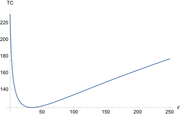
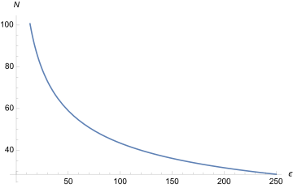

Two issues to address in this note:

- How much can the value of a Uniswap V2 sliding window TWAP oracle be manipulated within the oracle's update interval?

- How much capital is needed to profitably attack an Overlay market by manipulating the underlying price feed?

## Sliding Window Oracles

### Overview

Addressing the first question relates to using a [sliding window TWAP oracle](https://github.com/Uniswap/uniswap-v2-periphery/blob/master/contracts/examples/ExampleSlidingWindowOracle.sol) and the cost to attack the feed itself when using a `periodSize << windowSize`.

For context, if we fix the price on Overlay to each fetch from the oracle, we encounter issues with [data freshness](https://uniswap.org/docs/v2/smart-contract-integration/building-an-oracle/) for a fixed window oracle implementation, since we'd be fetching new scalar values every 1-8 hours. From a UX perspective as well, this is horrific since I need to wait the length of the `windowSize` for my trade to settle, which no one will do for a 1-8 hour window.

The alternative would be to use a sliding window TWAP oracle for each of our price feeds. Summary of how it works: every \\( \gamma \\) blocks (`periodSize`), we fetch and store a new [cumulative price value](https://uniswap.org/docs/v2/core-concepts/oracles/) from the Uni/SushiSwap feed. Assume we average our TWAP over \\( \Delta \\) blocks (`windowSize`) and \\( \gamma \ll \Delta \\) (e.g. \\( \gamma = 10 \mathrm{m}, \Delta = 1 \mathrm{h} \\) in block time).

The oracle keeps track of the trailing index of the observation at the beginning of the window relative to the current time index. To calculate the TWAP value for our Overlay market prices during the current update interval \\( t_i < t < t_i + \gamma \\), we simply take the difference in the cumulative price value of the last observation stored with that of the trailing index value and divide by the difference in timestamps of the last and trailing.

Explicitly, for a `windowSize` of \\( \Delta \\) blocks that we average our prices over, the TWAP at block \\( i \\) for our market feed is

\\[ \mathrm{TWAP}\_{\Delta}(i) = \frac{CP(i) - CP(i-\Delta)}{\Delta} \\]

where \\( CP(i) \\) is the Uni/SushiSwap price accumulator

\\[ CP(i) = \sum_{k=0}^{i} t(k) \cdot P(k) \\]

\\( t(k) \\) is the time elapsed between the end of block \\( k \\) and beginning of block \\( k+1 \\). \\( P(k) \\) is the price on Uni/SushiSwap at the end of block \\( k \\) and beginning of block \\( k+1 \\).

The sliding window TWAP queries the current TWAP value every \\( \gamma \\) blocks

\\[ \mathrm{TWAP}\_{\gamma, \Delta}(i) = \mathrm{TWAP}\_{\Delta}(i - \mathrm{mod}(i, \gamma)) \\]

such that our markets would only have the latest value of the TWAP every \\( \gamma \\) blocks.

### TWAP Manipulation

We want an explicit expression for how much the TWAP can change due to an attacker consistently manipulating the spot for \\( \nu \\) blocks within the averaging window \\( \nu \leq \Delta \\).

For simplicity's sake, take the price at each block recorded by the accumulator to be the same prior to the attack, and the attack to happen in the last \\( \nu \\) blocks of the averaging window:

\\[ P(i - \Delta) = P(i - \Delta - 1) = ... = P(i - \nu) = P_0 \\]
\\[ P(i - \nu + 1) = P(i - \nu + 2) = ... = P(i) = P_0 \cdot (1 + \epsilon) \\]

where the attacker manipulates the spot a percent difference \\( \epsilon \\) each block for the last \\( \nu \\) blocks.

Without loss of generality, we can examine the value of the sliding window TWAP at the beginning of the update interval, which reduces \\( \mathrm{TWAP}\_{\gamma, \Delta}(i) = \mathrm{TWAP}\_{\Delta}(i) \\). The value given by the sliding window TWAP will be

\\[ \mathrm{TWAP}\_{\gamma, \Delta}(i) = P_0 \bigg[ 1 + \frac{\nu}{\Delta} \cdot \epsilon \bigg] \\]

and the percent change in the TWAP \\( \epsilon_{\mathrm{TWAP}} \\) will be

\\[ \epsilon_{\mathrm{TWAP}} = \frac{\nu}{\Delta} \cdot \epsilon \\]

given a consistent spot change \\( \epsilon \\) for \\( \nu \\) blocks.

## Profitably Attacking Overlay

### Summary

Using a 10 minute update interval for a 1 hour sliding window TWAP on an underlying spot pool having liquidity of $20M+ and setting leverage max to 5x will likely be robust. Cost of attack should be approximately $240M+.

### Constructing the Trade

The value reported by the sliding window TWAP oracle is what traders will trade on this specific type of Overlay market. Using the above as an attacker, we should be able to take a position on Overlay with max leverage, manipulate the spot price to our advantage, and cash out the Overlay position for a profit. Understanding the break-even cost of such an attack will guide us in what TWAP feeds are suitable for the system as well as what constraints we must place on our max leverage values in order to make the cost of such an attack unreasonable.

Before the attack, take the price on the spot constant product \\( x \cdot y = k \\) market maker to be

\\[ P_0 = \frac{x^2}{k} = \frac{k}{y^2} \\]

where \\( x \\) is the number of tokens in reserve 0 and \\( y \\) the number of tokens in reserve 1 at block \\( i - \nu \\). The attacker has two options

1. Add \\( \delta x \\) tokens to the pool each block to increase the price
2. Add \\( \delta y \\) tokens to the pool each block to decrease the price

In the former case, we take out a max leverage long on the corresponding Overlay market. In the latter case, we take out a max short. To change the spot price for \\( \nu \\) blocks, the total number of tokens needed will be \\( \nu \cdot \delta x \\) for the former and \\( \nu \cdot \delta y \\) for the latter, assuming arbitrageurs move the price back to \\( P_0 \\) within each block after cumulative price values are recorded.

#### Option 1: \\( 0 < \epsilon < \infty \\)

In the former case, the trader attacks the Overlay market by increasing the TWAP value. After sending \\( \delta x \\) tokens to the spot pool, reserve 0 changes \\( x \to x + \delta x \\). The recorded price after the change will be

\\[ P_0 \cdot (1 + \epsilon) = \frac{(x + \delta x)^2}{k} \\]

Thus, the capital \\( \delta x \\) required to move the spot price up \\( \epsilon \\) is

\\[ \delta x = x \bigg[ \sqrt{1 + \epsilon} - 1 \bigg] \\]

Say we take out a long position on the corresponding Overlay TWAP market using OVL collateral \\( N \\) with leverage \\( L \\), prior to manipulating the spot. The value of our long position in OVL after manipulating the spot will be

\\[ V_l (i) = N + N \cdot L \cdot \epsilon\_{\mathrm{TWAP}} = N + N \cdot L \cdot \frac{\nu}{\Delta} \cdot \epsilon \\]

with the total cost to attack the system given by the sum of the collateral locked in the long \\( N \\) and the total tokens needed to manipulate the spot \\( \nu \cdot \delta x \\).

At what point is the attack profitable for the trader? When the value of the max long position exceeds the total cost to attack the system. Or the PnL for the attack

\\[ \mathrm{PnL}_{l} (i) = \nu \bigg[ \frac{N\_x \cdot L}{\Delta} \cdot \epsilon - x \cdot \bigg( \sqrt{1 + \epsilon} - 1 \bigg) \bigg] \\]

is greater than zero. \\( N_x \\) here is the initial collateral locked in the long expressed in \\( x \\) token terms. This translates to a break-even amount of collateral the attacker needs to lock in the long position for the attack to be worthwhile (\\( \mathrm{PnL}_l = 0 \\)):

\\[ N_x\|\_{B} = x \cdot \frac{\Delta}{L \cdot \epsilon} \cdot \bigg[ \sqrt{1 + \epsilon} - 1 \bigg] \\]

The total upfront cost to break-even with this attack is then

\\[ \mathrm{TC}\|_{B} = N_x\|\_{B} + \nu \cdot \delta x = x \cdot \bigg( \frac{\Delta}{L \cdot \epsilon} + \nu \bigg) \bigg[ \sqrt{1 + \epsilon} - 1 \bigg] \\]

for a spot price manipulation per block of \\( 0 < \epsilon < \infty \\).

#### Option 2: \\( -1 < \epsilon < 0 \\)

In the latter case, the trader attacks the Overlay market by decreasing the TWAP value. After sending \\( \delta y \\) tokens to the spot pool, reserve 1 changes \\( y \to y + \delta y \\). The recorded price after the change will be

\\[ P_0 \cdot (1 + \epsilon) = \frac{k}{(y + \delta y)^2} \\]

Thus, the capital \\( \delta y \\) required to move the spot price down \\( \epsilon \\) is

\\[ \delta y = y \bigg[ \frac{1}{\sqrt{1 + \epsilon}} - 1 \bigg] \\]

We take out a short position on the Overlay TWAP market using OVL collateral \\( N \\) with leverage \\( L \\), prior to manipulating the spot. The value of our short position in OVL after manipulating spot will be

\\[ V_s (i) = N - N \cdot L \cdot \epsilon\_{\mathrm{TWAP}} = N - N \cdot L \cdot \frac{\nu}{\Delta} \cdot \epsilon \\]

with the total cost to attack the system given by the sum of the collateral locked in the short \\( N \\) and the total tokens needed to manipulate the spot \\( \nu \cdot \delta y \\).

The PnL for the attack in this latter scenario is

\\[ \mathrm{PnL}\_{s}(i) = \nu \bigg[ \frac{N_y \cdot L}{\Delta} \cdot \| \epsilon \| - y \bigg( \frac{1}{\sqrt{1 - \|\epsilon\|}} - 1 \bigg) \bigg] \\]

where \\( N_y \\) is the initial collateral locked in the short expressed in \\( y \\) terms. This translates to a break-even amount of collateral

\\[ N_y \|_{B} = y \cdot \frac{\Delta}{L \cdot \| \epsilon \|} \cdot \bigg[ \frac{1}{\sqrt{1 - \| \epsilon \|}} - 1 \bigg] \\]

to make the attack worthwhile (\\( \mathrm{PnL}\_{s} = 0 \\)).

The total upfront cost to break-even with this attack is then

\\[ \mathrm{TC}\|_{B} = N_y\|\_{B} + \nu \cdot \delta y = y \cdot \bigg( \frac{\Delta}{L \cdot \| \epsilon \|} + \nu \bigg) \bigg[ \frac{1}{\sqrt{1 - \| \epsilon \|}} - 1 \bigg] \\]

for a spot manipulation per block of \\( -1 < \epsilon < 0 \\).

### Minimum Break-Even Cost

We can combine these two scenarios into a break-even cost function for the full range of spot price changes:

$$
\begin{eqnarray}
\mathrm{TC}|_{B} (\epsilon) =
\begin{cases}
y \cdot \bigg( \frac{\Delta}{L \cdot | \epsilon |} + \nu \bigg) \bigg[ \frac{1}{\sqrt{1 - | \epsilon |}} - 1 \bigg] & -1 < \epsilon < 0 \\
x \cdot \bigg( \frac{\Delta}{L \cdot \epsilon} + \nu \bigg) \bigg[ \sqrt{1 + \epsilon} - 1 \bigg] & 0 < \epsilon < \infty
\end{cases}
\end{eqnarray}
$$

which is dominated by

\\[ \lim_{\epsilon \to 0} \mathrm{TC}\|_{B} (\epsilon) = \frac{x}{2} \cdot \frac{\Delta}{L} = \frac{y}{2} \cdot \frac{\Delta}{L} \\]

for small changes in price per block. This relation gives rough constraints on the maximum leverage we can offer for a TWAP market given the underlying liquidity in the pool and the time averaged over to calculate the TWAP.

### Concrete Numbers

We can use the above expression for the break-even cost as guidance for which TWAP feeds are suitable to offer as Overlay markets in addition to what the maximum leverage allowed on a TWAP feed should be.

Assume the following reasonable numbers for parameters:

- \\( \Delta = 240 \\): for an approximately 1 hour TWAP
- \\( x = y = $10 \mathrm{M} \\): for a spot pool with liquidity of $20M
- \\( L = 5 \\): for maximum leverage of 5x

For the worst case scenario, we look at the case where the attacker only manipulates the spot price for one block, \\( \nu = 1 \\), which ultimately requires less upfront capital given our expression for \\( \mathrm{TC}\|_{B} \\) above.

Below are plots for the total upfront cost of a break-even attack vs spot price change per block required \\( \mathrm{TC}\|_{B} \\) vs \\( \epsilon \\)

and the total amount of OVL collateral (in dollar terms) needed to enter the position on the Overlay market for such an attack \\( N\|_{B} \\) vs \\( \epsilon \\)

with y-axis in millions of dollars.

Using this setup of a 1 hour TWAP with max leverage of 5x results in a minimum cost of attack on a $20M spot liquidity pool of approximately $118.56M (\\( \epsilon\_{\mathrm{min}} = 34.1436 \\)). The corresponding OVL collateral required to execute such an attack would be about $69.282M. These amounts scale linearly with liquidity in the spot pool.

This further emphasizes the need for caps on open interest on an Overlay TWAP market having a relatively illiquid spot pool (i.e. \\( < $100\mathrm{M} \\)). Governance can set the caps such that it is not even possible to enter a trade with \\( N\|_{B} \\) amount of OVL.

## Nuances with Oracles

With pricing fixed to fetches from the oracle every \\( \gamma \\) blocks, an additional attack vector must be accounted for. Assume a user wishes to build a position between oracle fetches at time \\( t \\) where \\( i < t < i+\gamma \\), block \\( i \\) was the last oracle fetch the market has information for with a price of \\( P(i) \\), and block \\( i+\gamma \\) will have the next oracle fetch to update the market price to whatever value is reported for \\( P(i+\gamma) \\) in the future. What should the locked in entry price be for this user's newly built position?

### The Naive Approach

If we were to naively choose the last fetched oracle value \\( P(i) \\) to use as this position's entry price, the system could be easily exploited. To see how this would work, make this assumption and take \\( P(t) = P(i) \\). Users have more up to date information about the current spot price than the Overlay market does at time \\( t \\).

As an attacker, I wait to act until the block prior to the end of the update interval. If the spot price at \\( i + \gamma - 1 \\) is significantly greater than the value of \\( P(i) \\), I take out a max leverage long on the market in anticipation of locking in a relatively sure profit given the likely increased value to be fetched for \\( P(i+\gamma) \\). Once the price has updated to \\( P(i+\gamma) \\), I sell my position from the prior block, causing the protocol to mint "free" OVL tokens. Repeat this many times over for each update interval going max long or short depending on the price direction, and the system will bleed OVL rapidly.

### Queueing Position Builds

To prevent this scenario, users building positions on an Overlay market at times between oracle fetches must receive the value of the feed at the next oracle fetch, such that \\( P(t) = P(i+\gamma) \\). From a UX perspective, this is a bit cumbersome given it takes at worst \\( \gamma \\) blocks for your trade to settle and your settlement price for building a position can vary within that timeframe. However, update intervals of 10 min for \\( \gamma \\) are not terrible and most users will likely choose to build positions close to the end of the update interval to minimize "slippage".

From an implementation perspective, settling the price for all positions in the prior update interval is relatively easy to accomplish, as the first user to build a trade in the next update interval sets the price for all positions in the prior interval. This is flash loan resistant as long as the price update happens prior to position entry. For redundancy, we can use [keepers](https://docs.keep3r.network/keepers) over slightly longer time horizons than \\( \gamma \\) (gas considerations here) to settle outstanding positions in the event a particular market does not see substantial volume.

### Settling on Unwind

Notice, however, this "free" minting can only occur when *building* a position. For unwinding an existing position, the user has already chosen to go long or short so can only save a portion of their loss or gain given their knowledge of the spot market within the current update interval. Since changes to the 1h TWAP within a 10 minute update interval \\( \epsilon_{\mathrm{TWAP}} \\) are approximately 1/6 of any spot changes, these deviations on Overlay market prices will likely be relatively small for a 10 minute candle on a larger market when compared to 1h TWAP changes over multiple \\( \Delta \\) windows for the position. Thus, from a UX perspective, it is likely best to let the user settle their *exit* price at \\( P(i) \\). Otherwise traders would be forced to unwind a position in two transactions, the trade and then a future withdraw of settled OVL funds from the contract.

## Considerations

[These issues](https://uniswap.org/audit.html#org87c8b91) should be addressed. The initial naive analysis above assumes arbitrageurs bring the price back immediately after every block. This is not necessarily the case but will be close to accurate for very liquid pairs.
