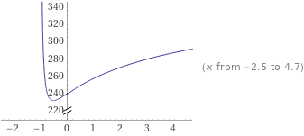

Two issues to address in this note:

- How much can the value of a Uniswap/SushiSwap **sliding window** TWAP oracle be manipulated within the oracle's update interval (which is much smaller than the time averaged over)?

- How much capital is needed to **profitably attack** an Overlay market by manipulating the underlying price feed?

## Sliding Window Oracles

### Overview

Addressing the first question relates to using a [sliding window TWAP oracle](https://github.com/Uniswap/uniswap-v2-periphery/blob/master/contracts/examples/ExampleSlidingWindowOracle.sol) and the cost to attack the feed itself when using a `periodSize << windowSize`.

For context, if we fix the price on Overlay to each fetch from the oracle, we encounter issues with [data freshness](https://uniswap.org/docs/v2/smart-contract-integration/building-an-oracle/) for a fixed window oracle implementation, since we'd be fetching new scalar values every 1-8 hours. From a UX perspective as well, this is horrific since I need to wait the length of the `windowSize` for my trade to settle, which no one will do for a 1-8 hour window.

The alternative would be to use a sliding window TWAP oracle for each of our price feeds. Summary of how it works: every \\( \gamma \\) blocks (`periodSize`), we fetch and store a new [cumulative price value](https://uniswap.org/docs/v2/core-concepts/oracles/) from the Uni/SushiSwap feed. Assume we average our TWAP over \\( \Delta \\) blocks (`windowSize`) and \\( \gamma \ll \Delta \\) (e.g. \\( \gamma = 10 \mathrm{m}, \Delta = 1 \mathrm{h} \\) in block time).

The oracle keeps track of the trailing index of the observation (at the beginning of the window) relative to the current time index. To calculate the TWAP value for our Overlay market prices during the current update interval \\( t_i < t < t_i + \gamma \\), we simply take the difference in the cumulative price value of the last observation stored with that of the trailing index value and divide by the difference in timestamps of the last and trailing.

Explicitly, for a `windowSize` of \\( \Delta \\) blocks that we average our prices over, the TWAP at block \\( i \\) for our market feed is

\\[ \mathrm{TWAP}\_i(\Delta) = \mathrm{TWAP}\_i = \frac{CP_i - CP_{i-\Delta}}{\Delta} \\]

where \\( CP_i \\) is the Uni/SushiSwap price accumulator

\\[ CP_i = \sum_{k=0}^{i} t_k \cdot P_k \\]

\\( t_k \\) is the time elapsed between the end of block \\( k \\) and beginning of block \\( k+1 \\). \\( P_k \\) is the price on Uni/SushiSwap at the end of block \\( k \\) and beginning of block \\( k+1 \\).

### TWAP Manipulation

For a `periodSize` of \\( \gamma \\), we want an explicit expression for how much the TWAP can change due to an attacker consistently manipulating the spot from blocks \\( i \\) to \\( i + \gamma \\) within the update interval. See the [Considerations](#Considerations) section below for ways we need to further expand.

We want to look at \\( \mathrm{TWAP}\_{i+\gamma} / \mathrm{TWAP}\_i - 1 \\), where \\( \mathrm{TWAP}\_{i+\gamma} = (CP_{i+\gamma} - CP_{i+\gamma - \Delta}) / \Delta \\). The value of the price accumulator at block \\( i + \gamma \\) is

\\[ CP_{i+\gamma} = CP_i + \sum_{k=i+1}^{i+\gamma} t_k \cdot P_k \\]

For simplicity's sake, assume the attacker manipulates the spot price a percent difference \\(\epsilon_{\gamma} \\) for each block in the update window (i.e. for \\( \gamma \\) blocks) such that

\\[ P_{i+1} = P_{i+2} = ... = P_{i+\gamma} = (1 + \epsilon_{\gamma}) \cdot P_i \\]

The value of the price accumulator at block \\( i + \gamma \\) will simplify to

\\[ CP_{i+\gamma} = CP_i + \gamma \cdot (1 + \epsilon_{\gamma}) \cdot P_i \\]

and \\( \mathrm{TWAP}\_{i+\gamma} \\) reduces to

\\[\mathrm{TWAP}\_{i+\gamma} = \frac{\gamma}{\Delta} \cdot (1 + \epsilon_{\gamma}) \cdot P_i + \frac{CP_i - CP_{i+\gamma-\Delta}}{\Delta} \\]

Simplify further (we can always generalize) by assuming prior to the update interval

\\[ P_{i-\Delta} = P_{i-\Delta+1} = ... = P_{i} \\]

such that \\(\mathrm{TWAP}\_{i} = P_i \\). We have \\( (CP_i - CP_{i+\gamma-\Delta}) / \Delta = P_i \cdot (\Delta - \gamma) / \Delta \\) and the TWAP at the end of the update interval is \\(\mathrm{TWAP}\_{i+\gamma} = P_i \cdot [ 1 + (\gamma/\Delta) \cdot \epsilon_{\gamma} ] \\). Then the change in the TWAP during the update interval \\( \epsilon^{\mathrm{TWAP}}\_{\gamma} \\) given a consistent spot change \\( \epsilon_{\gamma} \\) over the update interval's \\( \gamma \\) blocks will be

\\[ \epsilon^{\mathrm{TWAP}}\_{\gamma} = \frac{\mathrm{TWAP}\_{i+\gamma} - \mathrm{TWAP}\_{i}}{\mathrm{TWAP}\_{i}} = \frac{\gamma}{\Delta} \cdot \epsilon_{\gamma} \\]

## Profitably Attacking Overlay

### Summary

Using a 10 minute update interval for a 1 hour sliding window TWAP on an underlying spot pool having liquidity of $20M+ and setting leverage max to 5x will likely be robust. Cost of attack should be approximately $240M+.

### Constructing the Trade

Using the above as an attacker, I should be able to take a position on Overlay with max leverage, manipulate the spot price to my advantage within the update interval, and cash out the Overlay position for a profit. Understanding the break-even cost of such an attack will guide us in what TWAP feeds are suitable for the system as well as what constraints we must place on our max leverage values in order to make the cost of such an attack unreasonable.

Take the relevant price on a constant product (\\( R \cdot R' = k \\)) market maker at block \\( i \\): \\( P_i = k / R^2 \\), where \\( R \\) is reserve 0 and \\( R' \\) reserve 1 at block \\( i \\). The change in price for \\( x_{\gamma} \\) number of tokens swapped will be

\\[ \epsilon_{\gamma} = \frac{P_{i+\gamma} - P_i}{P_i} = \frac{1}{(1-x_{\gamma}/R)^2} - 1 \\]

which implies the capital to move the spot an amount \\( \epsilon_{\gamma} \\) is

\\[ x_{\gamma} = R \cdot \bigg[ 1 - \frac{1}{\sqrt{1+\epsilon_{\gamma}}} \bigg] \\]

Assuming arbitrageurs revert the price back to \\( P_i \\) after each block, the total amount of capital required on the spot side of the attack for \\( \gamma \\) blocks is

\\[ x = \sum_{k=i+1}^{i+\gamma} x_{\gamma} = R \cdot \gamma \cdot \bigg[ 1 - \frac{1}{\sqrt{1+\epsilon_{\gamma}}} \bigg] \\]

The attacker stakes \\( n_{\gamma} \\) OVL in a long position with leverage \\( l_{\gamma} \\) at block \\( i \\), then starts to manipulate the spot price from \\( i+1 \\) to \\( i+\gamma \\), when the next sliding window observation occurs. The payoff in OVL terms of the long position on the Overlay TWAP will be

\\[ \mathrm{PO}(t_{i+\gamma}) = n_{\gamma} \cdot ( 1 + l_{\gamma} \cdot \epsilon^{\mathrm{TWAP}}\_{\gamma} ) \\]

ignoring payoff contributions from [funding payments](note-1) since the attacker would likely cause significant imbalance with a large long position and total profit would suffer (below is conservative).

Assume they obtain \\( x \\) number of \\( R \\) tokens at block \\( i \\) to prepare for the attack. The total cost for the attack in OVL terms will be

\\[ C = n_{\gamma} + p^{OVL}_R (t_i) \cdot x \\]

where \\( p^{OVL}_R(t_i) \\) is the spot swap price at block \\( i \\) for the \\( R \\) token in terms of OVL. And total profit \\( \mathrm{PnL}(t\_{i+\gamma}) = \mathrm{PO}(t\_{i+\gamma}) - C \\) in OVL terms

\\[ \mathrm{PnL}(t_{i+\gamma}) = \frac{\gamma \cdot \epsilon_{\gamma}}{\Delta} \cdot \bigg[ n_{\gamma} \cdot l_{\gamma} - p^{OVL}_R(t_i) \cdot \frac{R \cdot \Delta}{\epsilon\_{\gamma}} \cdot \bigg( 1 - \frac{1}{\sqrt{1+\epsilon\_{\gamma}}} \bigg) \bigg] \\]

The attacker's trade is therefore only profitable when

\\[ n_{\gamma} > p^{OVL}_R(t_i) \cdot \frac{R \cdot \Delta}{l\_{\gamma}} \cdot \frac{1}{\epsilon\_{\gamma}} \cdot \bigg[ 1 - \frac{1}{\sqrt{1+\epsilon\_{\gamma}}} \bigg] \\]

Taylor expanding the root term, we have an inequality for the break-even amount of \\( n_{\gamma} \\) required to execute the long side of the trade

\\[ n_{\gamma} > p^{OVL}_R(t_i) \cdot \frac{R \cdot \Delta}{l\_{\gamma}} \cdot \bigg[ \frac{1}{2} - \frac{3}{8} \epsilon\_{\gamma} + \frac{5}{16} \epsilon^2\_{\gamma} - ... \bigg] \\]

which is independent of the `periodSize` \\( \gamma \\) to first order.

The break-even (\\( \mathrm{PnL} = 0 \\)) amount of OVL required to attack the system on the Overlay side of the trade is then

\\[ n_{\gamma}\|_{\mathrm{breakeven}} = p^{OVL}_R(t_i) \cdot \frac{R \cdot \Delta}{l\_{\gamma}} \cdot \frac{1}{\epsilon\_{\gamma}} \cdot \bigg[ 1 - \frac{1}{\sqrt{1+\epsilon\_{\gamma}}} \bigg] \\]

and the break-even total cost in dollar terms is

\\[ C\|_{\mathrm{breakeven}} = p^{$}_R(t_i) \cdot R \cdot \bigg(\frac{\Delta}{l\_{\gamma}} + \gamma \cdot \epsilon\_{\gamma} \bigg) \cdot \frac{1}{\epsilon\_{\gamma}} \cdot \bigg[ 1 - \frac{1}{\sqrt{1+\epsilon\_{\gamma}}} \bigg] \\]

where \\( p^{$}_R(t_i) \\) is the price of the \\( R \\) token in dollar terms at block \\( i \\).

### Concrete Numbers

We can use the above expression for the break-even cost as guidance for which TWAP feeds are suitable to offer as Overlay markets in addition to what the maximum leverage \\( l_{\gamma} = l_{\mathrm{max}} \\) allowed on a TWAP feed should be.

For a small change \\( \epsilon_{\gamma} \approx 0 \\) to the spot price for \\( \gamma \\) blocks, the dominant term in the break-even cost becomes the TWAP window size expression and to first order reduces to

\\[ C\|_{\mathrm{breakeven}} \approx p^{$}_R(t_i) \cdot \frac{R \cdot \Delta}{2l\_{\mathrm{max}}} \\]

Take \\( \Delta = 240 \\) for an approximately 1 hour TWAP. For a spot pool with liquidity of $20M, \\( p^{$}_R \cdot R = $10 \mathrm{M} \\). If we limit the max leverage allowed on this market to \\( l\_{\mathrm{max}} = 5 \\), break-even cost to attack the market would be

\\[ C\|_{\mathrm{breakeven}} (\Delta = 1 \mathrm{h}, R = $10 \mathrm{M}, l\_{\mathrm{max}} = 5, \epsilon\_{\gamma} \approx 0) \approx $240 \mathrm{M} \\]

which is substantial. If, however, the attacker is able to move the spot price within the update interval a large amount such that \\( \epsilon\_{\gamma} \gg 0 \\), the break-even cost increases.

Take \\( \gamma = 40 \\) for an approximately 10 minute update interval. The extreme case of \\( \epsilon\_{\gamma} \xrightarrow{} \infty \\) gives the break-even cost to attack the system through drastically manipulating the spot in the update interval

\\[ C\|_{\mathrm{breakeven}} (\gamma = 10 \mathrm{m}, \Delta = 1 \mathrm{h}, R = $10 \mathrm{M}, l\_{\mathrm{max}} = 5, \epsilon\_{\gamma} \xrightarrow{} \infty) \approx $400 \mathrm{M} \\]

which is still substantial. Plotting \\( C\|\_{\mathrm{breakeven}} (\epsilon\_{\gamma}) \\) with \\( \gamma = 10 \mathrm{m}, \Delta = 1 \mathrm{h}, R = $10 \mathrm{M}, l\_{\mathrm{max}} = 5 \\)

with y-axis in millions of dollars.

Using this setup of a 1 hour TWAP with 10 min update interval and max leverage of 5x results in a minimum cost of attack on a $20M spot liquidity pool of approximately $240M, which is likely robust.

### What About Flash Loans?

With pricing fixed to fetches from the sliding window TWAP oracle every \\( \gamma \\) blocks, an additional attack vector must be accounted for. Assume a user wishes to build a position between oracle fetches at time \\( t \\) where \\( t_{i} < t < t_{i+\gamma} \\), \\( t_i \\) is the last oracle fetch the market has information for with a TWAP value of \\( P_i \\), and \\( t_{i+\gamma} \\) is the pending next oracle fetch to update the TWAP to \\( P_{i+\gamma} \\). What should the locked in entry price be for this user's newly built position?

<!-- TODO: Mention would be a problem if didn't settle at t1 in t0 < t <= t1 timeframe -->
<!-- TODO: What about if the attacker doesn't obtain x R tokens in prep but does it continuously?  -->

## Considerations

[These issues](https://uniswap.org/audit.html#org87c8b91) should be addressed. Particularly with regard to liquidity in the `periodSize` interval for the sliding window TWAP oracle. The initial naive analysis above assumes arbitrageurs bring the price back immediately after every block. This is not necessarily the case but will be close to accurate for very liquid pairs.
