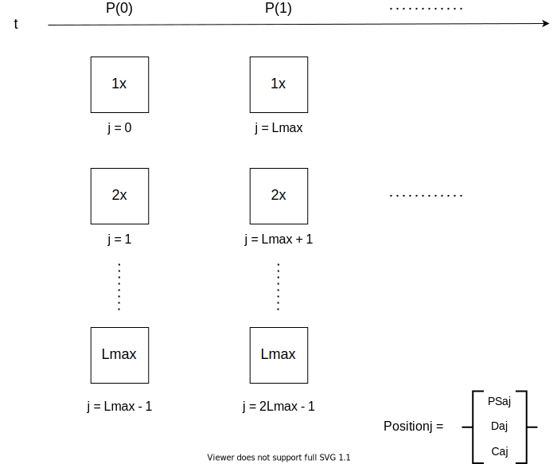

Issue to address with this note:

- Outline the bookkeeping in Overlay market contracts for a peer-to-pool model with leverage and funding payments.

## Context

Overlay allows users to express a view on a data stream without the need for traditional counterparties to take the other side of their position. The system accomplishes this through a peer-to-pool model. Users lock the settlement currency of the system (OVL) in Overlay market contract pools at a time \\( 0 \\) and, in exchange, receive a position token detailing the attributes of their position. At some time \\( t > 0 \\) in the future when they wish to exit their position, users can burn the position token through the market contract, and the market contract will compensate them for their profit or loss with more or less OVL than what they initially locked.

To compensate users for a profitable position when they exit their position, the market contract mints the amount of OVL associated with the realized profits to the circulating supply. The market contract then returns to the user the initial OVL collateral locked plus the newly minted OVL.

Conversely, for an unprofitable position, the market contract removes the amount of OVL associated with the realized losses from the circulating supply, by burning upon exit a portion of the initial OVL collateral locked. The market contract then returns to the user an amount of OVL equal to the initial collateral locked minus the burnt losses.

In this way, the passive OVL holder effectively acts as the counterparty to all unbalanced positions on Overlay markets through risk of dilution. This includes, in particular, spot OVL-ETH liquidity providers (LPs) that backstop liquidity for users to enter and exit the system.

A simple example, without leverage and [funding payments](note-1), to illustrate.

At time \\( 0 \\),

- Total circulating supply of OVL: 8,000,000 OVL. We have: 10 OVL

- We lock 10 OVL in a long position on the \\( X \\) feed for a market entry price of \\( x=100 \\)

At a future time \\( t \\),

- The \\( X \\) feed has gone up 20%. We take profits, unwinding our position at a market exit price of \\( x=120 \\)

- The market contract mints an additional 2 OVL to the total circulating supply. It returns 12 OVL to us

- Total circulating supply of OVL: 8,000,002 OVL. We have: 12 OVL.

If the \\( X \\) feed had gone down 20% instead, the market contract would have burned 2 OVL from the circulating supply and returned 8 OVL to us. The end state would have been a total circulating supply of 7,999,998 OVL, and we would have had a balance of 8 OVL.

Things get more complex when we include leverage and funding into a peer-to-pool model, with multiple positions and users to account for in a gas-efficient way. The purpose of this note is to outline the accounting with these dynamics.

## Dynamics with Leverage and Funding

### Approach

When approaching a peer-to-pool model with leverage and funding, we must consider what the best way would be to track both a user's share of the locked OVL collateral in the market contract as well as their total position size -- what we're calling a user's "open interest". We define the open interest attributed to a user when building a new position on the long \\( l \\) (short \\( s \\)) side to be the number \\( N \\) of OVL collateral locked times the leverage \\( L \\). For a position \\( j \\) on side \\( a \in \\{ l, s \\} \\), let the open interest attributed at build time \\( 0 \\) be

\\[ \mathrm{OI}\_{aj} (0) = L_{aj} \cdot N_{aj}(0) \\]

where \\( L_{aj} \\) is the initial leverage and \\( N_{aj}(0) \\) is the OVL collateral locked when \\( j \\) is first built.

Expanding on our previous example, if we're super bullish and want to build a position with 3x leverage

At time 0,

- We lock 10 OVL in a long position on the \\( X \\) feed with 3x leverage for a market entry price of \\( x = 100 \\)

- The market contract marks our position as having an open interest (OI) of 30 OVL. It is backed by 10 OVL of collateral and has a debt of 20 OVL

Without funding payments, a peer-to-pool model would be relatively simple to implement. The market contract would issue separate tokens linked to a user's portion of the collateral locked and track the initial leverage set for their position to determine PnL values. No need to worry about theirs and others' position sizes changing over time. With funding payments, however, the situation becomes more complex because collateral *and* open interest act like pooled quantities. Aggregate open interest on a side, and thus a user's share of that open interest, changes over time.

### Share of Open Interest

Funding payments are needed to balance the long vs short open interest on a market. In prior notes, we assumed the market contract could be called to execute simple periodic transfers, moving a portion of the aggregate open interest on the long (short) side to the aggregate open interest on the short (long) side. These funding payments draw down [risk to the system](note-4), eventually leading to a rebalancing of position sizes on a market given a long enough time horizon. The form taken for the funding payment at time \\( t \\) is

\\[ \mathrm{FP} (t) = k \cdot \mathrm{OI}\_{imb}(t) \\]

where \\( {\mathrm{OI}\_{imb}} (t) = {\mathrm{OI}_l} (t) - {\mathrm{OI}_s} (t) \\) is the aggregate open interest imbalance between the long \\( l \\) and the short \\( s \\) side on a market, and \\( k \in [0, \frac{1}{2}] \\) is a per-market parameter adjustable by governance. Aggregate open interest on side \\( a \\) is simply the sum of the open interest attributed to each position on that side

\\[ \mathrm{OI}\_{a} = \sum_{j} \mathrm{OI}\_{aj} \\]

How should this sequential transfer of aggregate open interest affect an individual user's share of the total collateral in the pool *and* their share of the open interest?

Usually with funding payments, one would have longs (shorts) pay shorts (longs) directly from their locked collateral amounts, with their share of funding paid proportional to the amount of open interest attributed to their position. However, this immediately causes issues when attempting to update open interest for our imbalance calculation, since the contract must loop through all allowed leverages and their share of the total collateral pool for both sides, which is far from ideal. Further, analyzing systemic risk becomes far more complicated vs our note on risk to the system.

Assume a position's share of the aggregate open interest on a side stays constant through funding. Instead of taking from (adding to) each position's collateral, the market contract shifts the open interest attributed to each position. The time evolution of the aggregate open interest on a side from time \\( t \\) (before funding) to \\( t + 1 \\) (after funding) would be

\\[ \mathrm{OI}\_l (t+1) = \mathrm{OI}\_l (t) - \mathrm{FP}(t) \\]

\\[ \mathrm{OI}\_s (t+1) = \mathrm{OI}\_s (t) + \mathrm{FP}(t) \\]

The amount a position pays (receives) each funding payment is then directly proportional to its pro-rata share of the aggregate open interest on a side

\\[ \mathrm{OI}\_{aj} (t+1) = \mathrm{OI}\_{aj} (t) \; (\mp)\_a \; \mathrm{PS}\_{aj} \cdot \mathrm{FP}(t) \\]

where we define \\( \mathrm{PS}\_{aj} \equiv \frac{\mathrm{OI}\_{aj} (t)}{\mathrm{OI}\_{a} (t)} \\) to be position \\( j \\)'s share of the aggregate open interest on side \\( a \\). \\( (\mp)\_a = -1 \\) for \\( a  = l \\) and \\( (\mp)\_a = +1 \\) for \\( a = s \\).

After \\( m \\) funding payments, the aggregate open interest imbalance reduces to

\\[ \mathrm{OI}\_{imb} (t+m) = \mathrm{OI}\_{imb} (t) \cdot ( 1 - 2k )^{m} \\]

with open interest evening out between the long and short sides given enough time. Total (long + short) open interest will be an invariant with respect to funding

\\[ \mathrm{OI} = \mathrm{OI}\_{l} + \mathrm{OI}\_{s} = \mathrm{const} \\]

Funding becomes simple to implement. We pay funding in discrete intervals every [``periodSize``](note-2) blocks at the oracle fetch. A call to distribute funding payments at time \\( t+m \\), \\( m \\) funding intervals after the last update, should adjust a market's aggregate open interest according to

\\[ \mathrm{OI}\_{l} (t+m) = \frac{1}{2} \bigg[ \mathrm{OI}\_{l} (t) + \mathrm{OI}\_{s} (t) + (\mathrm{OI}\_{l} (t) - \mathrm{OI}\_{s} (t)) \cdot ( 1 - 2k )^{m} \bigg] \\]

\\[ \mathrm{OI}\_{s} (t+m) = \frac{1}{2} \bigg[ \mathrm{OI}\_{l} (t) + \mathrm{OI}\_{s} (t) - (\mathrm{OI}\_{l} (t) - \mathrm{OI}\_{s} (t)) \cdot ( 1 - 2k )^{m} \bigg] \\]

where \\( \\{\mathrm{OI}\_{l} (t), \mathrm{OI}\_{s} (t) \\} \\) are the values stored before the update and we've used the total open interest invariant to arrive at these expressions. <!-- TODO: edge cases of zero OI on a side -->

If we, as user \\( i \\), own a portion of position \\( j \\) ([ERC-1155](https://eips.ethereum.org/EIPS/eip-1155)), our share of the aggregate open interest at any time will be

\\[ \mathrm{OI}\_{aij}(t) = \mathrm{S}\_{aij} \cdot \mathrm{PS}\_{aj} \cdot \mathrm{OI}\_{a}(t) \\]

where we define \\( \mathrm{S}\_{aij} \equiv \frac{\mathrm{OI}\_{aij}(t)}{\mathrm{OI}\_{aj}(t)} \\) to be user \\( i \\)'s share of position \\( j \\).

### Accounting for Collateral

A user's share of open interest *and* their share of the collateral locked in a market contract are needed to calculate the value of their position, and thus the amount of OVL to return to them at exit.

From prior notes, the value of position \\( j \\) at time \\( t \\) is

\\[ V_{aj} (t) = N_{aj} (t) \; (\pm)_a \; \mathrm{OI}\_{aj} (t) \cdot \bigg( \frac{P(t)}{P(0)} - 1 \bigg) \\]

when expressed in terms of share of collateral and open interest. \\( P(i) \\) is the market value fetched from the oracle \\( i \\) blocks after entry, with time \\( 0 \\) used here for this particular position's entry. \\( (\pm)\_a = +1 \\) for \\( a  = l \\) and \\( (\pm)\_a = -1 \\) for \\( a = s \\).

What is the amount of collateral \\( N_{aj} (t) \\) to attribute to position \\( j \\) after funding payments are made? Given we are *not* taking directly from collateral amounts to pay for funding, the answer is not completely obvious. We also ideally want to update only pooled open interest amounts, without having to loop through each leverage type outstanding to update collateral amounts as well.

Instead, define the debt position \\( j \\) owes to the system for using initial leverage \\( L_{aj} \\) as

\\[ D_{aj} \equiv \mathrm{OI}\_{aj} (0) - N_{aj} (0) = N_{aj} (0) \cdot (L_{aj} - 1) \\]

The total debt associated with \\( j \\) is constant through funding, and does not need to be updated whenever payments are made. The value of position \\( j \\) at time \\( t \\) becomes

\\[ V_{aj} (t) = \mathrm{OI}\_{aj} (t) \cdot \bigg[ 1 \; (\pm)\_a \; \bigg( \frac{P(t)}{P(0)} - 1 \bigg) \bigg] - D_{aj} \\]

with the collateral allocated to position \\( j \\) at time \\( t \\)

\\[ N\_{aj} (t) \equiv \mathrm{OI}\_{aj} (t) - D_{aj} \\]

Thus, to assess the value of a position at any time \\( t \\), we only need to store the following static quantities for each position \\( j \\) (static as in they will *not* change through funding):

- \\( \mathrm{PS}_{aj} \\) -- \\( j \\)'s share of the aggregate open interest on side \\( a \\)

- \\( D_{aj} \\) -- \\( j \\)'s debt to the system

- \\( C_{aj} \\) -- \\( j \\)'s cost at build, which is the initial OVL collateral amount locked \\( N_{aj}(0) \\)

- \\( P(0) \\) -- \\( j \\)'s entry price from the market's oracle feed

Dynamic pooled quantities are limited to the aggregate open interest on each side \\( \mathrm{OI}\_{a}(t) \\).

Attributing entry price \\( P(0) \\) as a static quantity to position \\( j \\) assumes users can *not* add additional collateral after build time \\( 0 \\). This requirement allows for a semi-fungible implementation: shares in a position are fungible (i.e. many users can own a portion of a position), but positions themselves are non-fungible with respect to each other. We recommend this approach, particularly with the ERC-1155 standard, because tokenization of each position offers composability with other DeFi protocols and the ability to e.g., buy or sell Overlay positions on secondary markets.

### Returns on Unwind

When building position \\( j \\), the system mints to the market contract the debt \\( D\_{aj} \\) needed to fully realize position size \\( \mathrm{OI}_{aj}(0) \\). This covers the edge case with funding payment transfers when one side has aggregate open interest equal to zero (no positions outstanding). The system can then simply *burn* the funding payment to draw down risk, such that e.g.,

\\[ \mathrm{OI}\_{lj}(t+m) = \mathrm{OI}\_{lj}(t) \cdot (1 - 2k)^m \\]

\\[ \mathrm{OI}\_{sj}(t+m) = \mathrm{OI}\_{sj}(t) = 0 \\]

since the market contract will have the OVL necessary to execute the burn.

Fully realizing the position size at build, however, requires we also burn the equivalent amount of debt \\( D\_{aj} \\) at unwind, while factoring in any profit or loss. The PnL associated with position \\( j \\) at time \\( t \\) will be

\\[\mathrm{PnL}\_{aj}(t) = V_{aj}(t) - C_{aj} = \mathrm{OI}\_{aj} (t) \cdot \bigg[ 1 \; (\pm)\_a \; \bigg( \frac{P(t)}{P(0)} - 1 \bigg) \bigg] - \mathrm{OI}_{aj}(0)\\]

At unwind time \\( t \\), the market contract returns \\( V_{aj}(t) \\) in OVL to the user unwinding all of position \\( j \\) (assuming only one user owns shares in the position). If the profit for position \\( j \\) exceeds the position's outstanding debt, the system mints to the market contract the difference \\( \mathrm{PnL}\_{aj}(t) - D_{aj} \\) and returns the value of the position to the user. If the profit/loss is less than the debt, the system burns the difference \\( D_{aj} - \mathrm{PnL}\_{aj}(t) \\) and returns the remaining value of the position to the user.

Factoring in multiple users owning shares of position \\( j \\) is trivial, with any profit/loss, value, cost and debt split pro-rata amongst each user \\( i \\). For example, the value returned to user \\( i \\) unwinding \\( \mathrm{S}_{aij} \\) shares in position \\( j \\) at time \\( t \\) is

\\[ V_{aij}(t) = \mathrm{S}_{aij} \cdot V\_{aj}(t) \\]

with the associated shares of the position also burned to prevent multiple redemptions. \\( \mathrm{S}_{aij} \\) are minted at build time.

### Position Tokens

*TODO:*

1. Queueing up position builds at \\( T+1 \\) oracle fetch
2. Price pointer for each different leverage variant settling at \\( T+1 \\). So prices are a list with elements potentially unfilled until next oracle fetch at \\( T+1 \\)
3. Position \\( j \\) is attributed a number of shares \\( \mathrm{PS}\_{aj} \\) of the total open interest on side \\( a \\).
4. On build, user \\( i \\) receives a share of position \\( j \\) and the collateral, debt, open interest associated with \\( j \\). Those positions are ERC1155, such that shares in a position are fungible (many users can own a portion of a position), but positions themselves are non-fungible.
5. We track aggregate open interest on long and short sides. Each position \\( j \\) is attributed a certain number of shares of tracked aggregate open interest on a side, in addition to the total debt owed by and initial collateral staked in the position.
6. After each update period (oracle fetch), a new set of positions for long and short sides as well as leverages up to \\( L_{\mathrm{max}} \\) get queued up for next oracle price fetch (\\( T+1 \\) settlement)
7. Variables that evolve over time are limited to *only* aggregate open interest either long or short side.

### Open Margin and Liquidations
