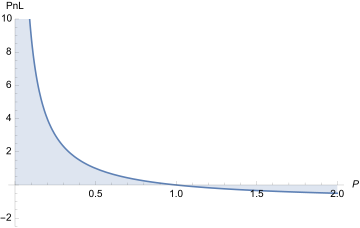
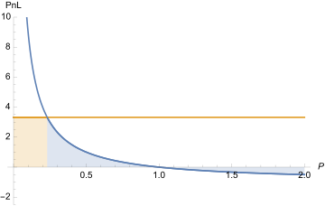

Issue to address with this note:

- How do we prevent payouts that would otherwise bankrupt the system? i.e. avoid becoming [Taleb's turkey](https://www.riskmanagementmonitor.com/lets-not-be-turkeys/)

## Context

<blockquote class="twitter-tweet">
Talib <a href="https://twitter.com/search?q=%24Titan&amp;src=ctag&amp;ref_src=twsrc%5Etfw">$Titan</a> Turkey <a href="https://t.co/6JvUjkYddn">pic.twitter.com/6JvUjkYddn</a>
&mdash; Flood (@ThinkingUSD) <a href="https://twitter.com/ThinkingUSD/status/1405311057480929282?ref_src=twsrc%5Etfw">June 16, 2021</a></blockquote> 

For us, a death spiral can occur with Overlay's OVL-X inverse markets, where X is ETH, DAI, etc., when all open interest on these markets is bearish OVL and a significant price drop of OVL relative to X occurs.

The payout of bearish OVL trades trends toward infinity as the price of OVL relative to X goes to zero, given the nature of the inverse market. Infinite printing by the market contract from this payout would lead to a collapse of the system.

### Background

Recall, passive OVL holders are effectively the counterparty for any PnL resulting from an imbalance in open interest on a market, taking on dilution risk -- the protocol prints more OVL to the circulating supply to cover imbalance profits. Funding payments from longs (shorts) to shorts (longs) [draw down this risk](note-4) over time.

The protocol remains liable for any PnL associated with an imbalance in open interest on a market. The amount of OVL the protocol will need to print at some time in the future \\( m \\) to cover this PnL is

\\[ \mathrm{PnL}(m) = \mathrm{OI}\_{imb}(0) \cdot (1 - 2k)^{m} \cdot \bigg[ \frac{P(m)}{P(0)} - 1 \bigg] \\]

where we make the simplifying assumption here that all existing positions were built at the same time \\( 0 \\). An appropriate funding constant \\( k \in [0, \frac{1}{2}] \\) for each market can be determined through statistical methods, modeling price \\( P(m) \\) as a stochastic process. Governance can then adjust \\( k \\) on-chain based on value at risk metrics all token holders are comfortable with.

However, what if imbalance risk isn't drawn down quick enough through funding? How do we definitively cap dilution risk over a set amount of time?

This is particularly worrisome for the OVL-X inverse markets, as PnL to be printed for a bearish OVL imbalance looks like

where we've normalized with respect to initial imbalance and initial price. As the price of OVL relative to X trends toward 0, the protocol is forced to print more and more OVL for profitable bearish trades. Bears can then dump this OVL on spot alongside further bearish positions on the inverse market to collapse the spot price more, print more OVL, and continue dumping. Rinse and repeat, and the system eventually prints to infinity.

## Stopping the Death Spiral

Building on prior caps work in [WPv1](https://firebasestorage.googleapis.com/v0/b/overlay-landing.appspot.com/o/OverlayWPv3.pdf?alt=media).

To mitigate the death spiral, we can include:

- Payoff caps -- limits max percent change in price for position payoff offered to traders

- Dynamic OI caps -- limits *new* position builds when market has printed an excessive amount of OVL over a prior period of time (cooldown on trading)

Constant payoff and OI caps make it possible to enforce a worst case amount printed *per trade*. Dynamic OI caps take this a step further and make it possible to enforce the worst case amount printed *over a period of time*, by limiting trading if excessive printing has happened in the recent past. Thus, the combination of payoff caps with dynamic OI caps offers us an avenue to enforcing a worst case inflation rate.

The maximum amount the system is allowed to print over a given period of time will then degenerate to

\\[ \mathrm{PnL} \|\_{max} = C_{\mathrm{OI}} \cdot C_{P} \\]

irrespective of future price.

- \\( C_{P} \\) is the payoff cap putting a maximum on \\( [\frac{P(m)}{P(0)} - 1] \\) offered to traders. This can be set

- \\( C_{\mathrm{OI}} \\) is the dynamic OI cap putting a maximum on \\( \mathrm{OI}\_{imb} \\) taken on by the market contract. This can be set and lowers/raises dependent on the amount of printing that has occurred in the prior \\( \omega \\) blocks.

### Payoff Caps

Payoff caps [limit the downside exposure](http://static.stevereads.com/papers_to_read/errors_robustness_and_the_fourth_quadrant.pdf) the protocol has to tail events in the price of the underlying feed, enforcing a predictable (non-random) worst case scenario *per trade*. Consider a more empirically accurate model than log-normal for the price of the TWAP market:

\\[ P(t) = P(0) e^{\mu t + \sigma L_t} \\]

where \\( L_{t} \\) is a Levy stable stochastic process with increments that follow a [stable distribution](https://en.wikipedia.org/wiki/Stable_distribution) \\( L_{t+u} - L_{t} \sim S(a, b, 0, (\frac{u}{a})^{\frac{1}{a}}) \\). \\( a \\) is the stable distribution stability parameter, \\( b \\) is the skewness parameter, and \\( c = (\frac{u}{a})^{\frac{1}{a}} \\) is the scale parameter, for time increments of length \\( u \\). For \\( a = 2 \\) and \\( b = 0 \\), this reduces to Geometric Brownian motion.

### Dynamic OI Caps

Looking at prior \\( n \\) update periods to see how much market has printed over a rolling window. Compare with max worst case local inflation rate willing to tolerate (market param).

If larger than max inflation rate, market dynamically lowers OI cap to zero to prevent new positions from being built until long enough time has passed for window to see rolling inflation rate below max. Then, we are setting a worst case inflation rate per market in stone instead of being solely probabilistic.

In practice, what does this look like in readjusting the inflation cap upward after cooldown period? Additionally, how should we gradually ease cap down if rate seems to be increasing over time (acceleration), so dynamic cap is somewhat smooth in readjustments?

Mitigates death spiral through two layers:

1. Cap on contract payoff limits infinite printing from one existing set of short positions on inverse market. We know what is the worst case amount we can print on one "cycle" of OI builds.

2. Dynamic OI cap prevents recycling of collateral from capped short payout immediately into a set of *new* short positions on the inverse market, slowing traders ability to ride price down further after dumping prior profits -- a circuit breaker. Effectively can ensure worst case inflation rate by dynamically limiting max aggregate OI market is willing to take on for prolonged period of time.

Do we have problems if keep bumping up against max inflation rate cap and lowering caps or short circuiting trading constantly? Is this a reason for having smooth increases/decreases in dynamic cap by market contract? Or are sudden stops better?
