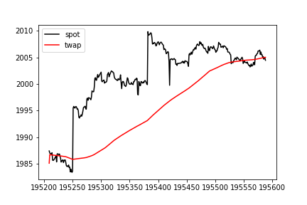
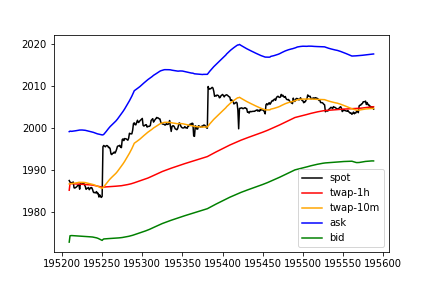
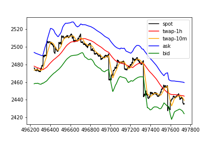
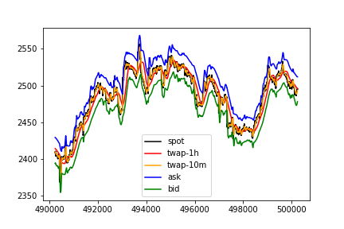
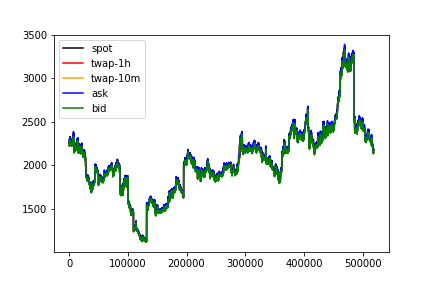
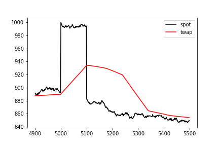
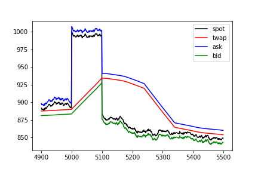

Issue to address with this note:

- Prevent traders from taking advantage of the fact that the TWAP is a lagging indicator of the spot price.

## Context

Offering Uniswap TWAPs as markets on Overlay comes with a catch. The TWAP averaged over the previous \\( \Delta \\) blocks only catches up to changes in the spot price *after the next* \\( \Delta \\) blocks have gone by. This is easily exploitable as a trader, particularly on large jumps in spot.

A trader could wait for a jump to happen on the spot market, realize the direction the TWAP will be going once it catches up to spot over the next \\( \Delta \\) blocks, and scalp an easily assured profit. We've already seen this on [Kovan](https://kovan.overlay.exchange/) with our old contracts.

For example,

displaying 1.5 hours of [simulated data](https://github.com/overlay-market/pystable/blob/main/example/montecarlo.py) generated from fits to ETH-DAI historical price data. The TWAP is averaged over an hour.

The 1h TWAP value immediately after spot jumps from 1983.65 to 1995.48 is still around 1985.86, and the 1h TWAP value an hour after the jump catches up is 2002.48. If we offer the long entry and exit prices at the rolling 1h TWAP value, the scalp trade over an hour yields easy money.

## Responsive Spreads

To prevent traders from taking advantage of the lag, one solution is to add a "bid-ask spread" to the entry and exit values Overlay markets offer to traders. Such a spread should be responsive to large jumps in the most recent spot price while also inheriting the security properties of the TWAP when traders wish to ultimately take profits.

We propose the bid \\( B \\) and ask \\( A \\) prices offered to traders at time \\( t \\) be

\\[ B(t, Q_s) = \min \bigg[\mathrm{TWAP}(t-\nu, t), \mathrm{TWAP}(t-\Delta, t) \bigg] \cdot e^{-\delta - \lambda Q_s} \\]

\\[ A(t, Q_l) = \max \bigg[\mathrm{TWAP}(t-\nu, t), \mathrm{TWAP}(t-\Delta, t) \bigg] \cdot e^{\delta + \lambda Q_l}  \\]

where \\( \nu \ll \Delta \\).

Longs receive the ask as their entry price and the bid as their exit price. Shorts receive the bid as their entry price and the ask as their exit price.

\\( \mathrm{TWAP}(t-\nu, t) \\) is a shorter TWAP used as a proxy for the most recent spot price. Traders unfortunately receive the worst possible price, but it does protect the system both against the predictability of the lag in the longer TWAP *and* [spot price manipulation](#spot-manipulation). Good starting values to average over would be \\( \nu = 40 \\) for a 10m shorter TWAP and \\( \Delta = 240 \\) for a 1h longer TWAP.

\\( \delta \\) is a static spread, on top of the bid-ask TWAP values, used to discourage front-running of the shorter TWAP, which acts as a proxy for spot. Spot values from Uniswap pools shouldn't be used, as they [are vulnerable to manipulation](https://samczsun.com/taking-undercollateralized-loans-for-fun-and-for-profit/).

\\( \lambda Q_a \\) is a market impact term to minimize the damage associated with front-running the TWAP in the event the spot price spikes above the static spread. \\( Q_a \\) is the queued open interest on side \\( a \in \\{ l, s \\} \\), imposed when new positions are built.

Applying a static spread with \\( \delta = 0.00624957 \\) to the 1.5 hours of simulated data plotted above

shows the scalp is no longer profitable over the hour following the jump, as the same long trade now has an entry price at the ask of 1998.31, immediately after the jump, and an exit price at the bid of 1990.01, 1 hour after the jump.

The downside with this approach is we likely reduce the amount of higher frequency trading that occurs on the platform. Over shorter time horizons, it becomes more difficult to exit with a profit, as one has to overcome the spread. For example, examining 6 hours of simulated data

shorting the local top here gives an entry price at the bid of 2489.67 and an exit price at the ask of 2459.50, for a profit (without fees) of 1.21%. Spot on the other hand moved 3% over the same period.

Over longer time horizons, traders can still make significant profits. Looking at 2 days

and 3 months of simulated data

shows markets remain tradeable.

## Spot Manipulation

Uniswap offers the TWAP as a method for offering a [manipulation-resistant on-chain oracle](https://uniswap.org/whitepaper.pdf).

<!--

However, we're suggesting using *both* the TWAP and the current spot price to determine what entry and exit prices to give traders. At first glance, [this is rather concerning](https://samczsun.com/taking-undercollateralized-loans-for-fun-and-for-profit/).

Are Overlay markets now susceptible to manipulation of the spot price?

Take the example of an attacker manipulating the spot price upward. In another round of sims, we add a shock of ~10% over 100 blocks

to use as an example.

**Q: Are we comparing the rate against known good rates as samczsun suggests? There's an attack potentially with spot manipulation**

*NOTE: There is a possible attack on others positions: user manipulates the spot price to cause other user's queued OI to settle at a worse price than they would have had otherwise. This grief attack doesn't cause any profit for the user who is causing it however so it's a complete burning of capital. Given liquid spot markets take significant amounts of capital to manipulate, it seems unlikely we should be overly concerned about this griefing attack.*
*
* -->

## Calibrating \\( \delta \\)

\\( \delta \\), as an additional static spread, offers protection against large jumps in spot that happen over shorter timeframes than \\( \nu \\). To calibrate, we can use the statistical properties of the underlying feed.

Our goal is to have the static spread \\( e^{\pm \delta} \\) produce bid and ask values that e.x. 99% of the time will be worse than any jumps that are likely to occur in the spot price over a 10 minute interval. This guards against the timelag associated with the shorter 10 minute TWAP versus the actual spot price.

To accomplish this, we suggest setting the spread to

\\[ \delta = \frac{1}{2} \bigg[ \mu \nu + \sigma \cdot \bigg(\frac{\nu}{a}\bigg)^{1/a} F^{-1}_{ab}(1-\alpha) \bigg] \\]

such that the value at risk to the system from a trader entering into the TWAP scalp over the next \\( \nu \\) blocks is equal to zero with confidence \\( 1-\alpha \\).

\\( F^{-1}_{ab} \\) is the inverse CDF for the standard [Levy stable](https://en.wikipedia.org/wiki/Stable_distribution) \\( S(a, b, 0, 1) \\).

\\( \mu \\), \\( \sigma \\), \\( a \\) and \\( b \\) are parameters expressed per-block above, fit using historical data assuming log-stable increments for the underlying spot price

\\[ P(t+\tau) = P(t) e^{\mu \tau + \sigma L\_{\tau}} \\]

where \\( L\_{\tau} \sim S(a, b, 0, (\frac{\tau}{a})^{1/a}) \\).

### Concrete Numbers

We use [`pystable`](https://github.com/overlay-market/pystable) to fit 120 days of 10 minute data on the [USDC-WETH SushiSwap pool](https://analytics.sushi.com/pairs/0x397ff1542f962076d0bfe58ea045ffa2d347aca0), from timestamp `1618868463` (April 19, 2021) to `1626472862` (July 16, 2021).

Per-block parameter values obtained are `a = 1.4029884974837792`, `b = -0.008110504596997956`, `mu = -1.4909873693826263e-07`, `sig = 0.00012610528857189945`.

For 99% confidence (`alpha = 0.01`), we have `delta = 0.006551445624571194`. This is a spread of about 65 bps on either side of the TWAP (1.3% total).

Console logs to replicate above are in [this gist](https://gist.github.com/mikeyrf/b8202b738b2f594f87e81cdc3bd5a41c#file-spread-calc-md).

### Derivation

Formally, the maximum attainable profit after \\( \nu \\) blocks, \\( \mathrm{VaR}(\alpha, \nu) \\), from the long scalp trade is given by

$$\begin{eqnarray}
1-\alpha &=& \mathbb{P}[ \mathrm{PnL}(Q, t+\nu) \leq \mathrm{VaR}(\alpha, \nu) | \mathcal{F}_{t-\nu} ] \\
&\approx& \mathbb{P}\bigg[ Q \cdot \bigg( \frac{P(t)}{P(t-\nu)} e^{-2\delta - \lambda Q} - 1 \bigg) \leq \mathrm{VaR}(\alpha, \nu) | \mathcal{F}_{t-\nu} \bigg] \\
&=& \mathbb{P}\bigg[ Q \cdot \bigg( e^{\mu \nu + \sigma L_{\nu} -2\delta - \lambda Q} - 1 \bigg) \leq \mathrm{VaR}(\alpha, \nu) \bigg]
\end{eqnarray}$$

assuming confidence \\( 1-\alpha \\), where \\( Q \\) is the long open interest taken out by the trader.

Our market contracts can only rely on stale information from the oracle feed before the current time \\( t \\): \\( \mathcal{F}_{t-\nu} \\). We've made simplifying assumptions to reflect this by having our entry and exit TWAP values

- \\( \mathrm{TWAP}(t, t+\nu) \sim \mathrm{TWAP}(t, t+\Delta) \sim P(t) \\)
- \\( \mathrm{TWAP}(t-\nu, t) \sim P(t-\nu) \\)

take similar values to the spot price \\( \nu \\) blocks in the past. To understand why, reference our first plot in [responsive spreads](#responsive-spreads):

- Jump occurs at t=195250
- Spot at t=195250 jumps from 1985 to ~2000
- 10m TWAP at t=195250 remains in line with spot 10m prior (before jump)
- 10m TWAP at t=195290 (40 blocks or 10m after jump) finally catches up with the spot value at t=195250

The value at risk due to this long scalp is then

\\[ \mathrm{VaR}(\alpha, \nu) = Q \cdot \bigg[ e^{\mu \nu + \sigma \cdot (\frac{\nu}{a})^{1/a} F^{-1}_{ab}(1-\alpha) - 2\delta - \lambda Q } - 1 \bigg] \\]

which is less than or equal to zero when

\\[ \delta = \frac{1}{2} \bigg[ \mu \nu + \sigma \cdot \bigg( \frac{\nu}{a} \bigg)^{1/a} F^{-1}_{ab}(1-\alpha) \bigg] \\]

regardless of market impact on entry, \\( \lambda Q \\).

Setting our static spread \\( \delta \\) to this expression implies that, with confidence \\( 1-\alpha \\), the value at risk to the system after the next \\( \nu \\) blocks from front-running the shorter TWAP will be at most zero, once the TWAP catches up to spot.

## Calibrating \\( \lambda \\)

\\( \lambda Q \\), as an additional market impact term, offers protection against large jumps in spot that *exceed* our expectations used in calibrating \\( \delta \\). Furthermore, imposing significant market impact (i.e. slippage) on large trades guards the system against traders who have more information than what is currently reflected in the market's current spot price.

Our goal is to have the market impact term \\( e^{\lambda Q} \\) produce bid and ask values that will minimize the expected profits from the scalp in the e.x. 1% of the time *when* spot jumps more than the static spread over a 10 minute interval.

To accomplish this, we suggest setting the market impact parameter to

\\[ \lambda = \frac{1}{Q_0} \cdot \ln \bigg[\frac{\int_0^{g^{-1}(C_p)} dy \; e^{y} f_{Y_{\nu}} (y)}{ [1-F_{Y_{\nu}}(0)] - (1+C_p) \cdot [1-F_{Y_{\nu}} (g^{-1}(C_p))] }\bigg] \\]

such that the expected value (EV) of the PnL for the scalp trade in the case when spot exceeds the spread over the next \\( \nu \\) blocks is less than or equal to zero for \\( Q \geq Q_0 \\).

\\( f_{Y_{\nu}} \\) and \\( F_{Y_{\nu}} \\) are, respectively, the PDF and CDF of \\( Y_{\nu} \sim S(a, b, \mu \nu - 2\delta, \sigma \cdot (\frac{\nu}{a})^{1/a}) \\).

\\( C_p \\) is the payoff cap imposed on the position to [limit the damage](note-7) associated with the tails.

Choices for \\( Q_0 \\) can be framed with respect to a percentage of our market's open interest cap, \\( Q_{max} \\). Governance must choose a value for \\( Q_0 \\) that balances EV risks from the scalp trade vs platform usability risks due to severe slippage. We give suggested values with concrete numbers below.

### Concrete Numbers

### Derivation

We want to minimize the expected value of the trader's PnL from the scalp, assuming the PnL would be > 0 without imposing market impact on the trade (i.e. spot has spiked beyond the static spread). Formally, the expected value conditioned on the scalp trade being profitable without market impact is given by

$$\begin{eqnarray}
\mathbb{E} \bigg[ \mathrm{PnL} (Q, t+\nu) | \mathrm{PnL}_{\lambda = 0} > 0 \bigg] &\approx& \mathbb{E} \bigg[ Q \cdot \bigg( e^{Y_{\nu} - \lambda Q} - 1 \bigg) | Y_{\nu} > 0 \bigg] \\
&=& \frac{Q \int_0^{\infty} dy \; f_{Y_{\nu}} (y) \cdot [e^{y - \lambda Q} - 1]}{\int_0^{\infty} dy \; f_{Y_{\nu}} (y)} \\
&=& Q \cdot \bigg[\frac{e^{- \lambda Q} \int_0^{\infty} dy \; e^{y} f_{Y_{\nu}} (y)}{\int_0^{\infty} dy \; f_{Y_{\nu}} (y)} - 1\bigg] \\
&=& Q \cdot \bigg[e^{h - \lambda Q} - 1\bigg]
\end{eqnarray}$$

where

\\[ h = \ln \bigg[\frac{\int_0^{\infty} dy \; e^{y} f_{Y_{\nu}} (y)}{\int_0^{\infty} dy \; f_{Y_{\nu}} (y)}\bigg] \\]

\\[ Y_{\nu} \equiv \mu \nu - 2\delta + \sigma L_{\nu} \\]

and \\( f_{Y_{\nu}} \\) is the PDF of \\( Y_{\nu} \sim S(a, b, \mu \nu - 2\delta, \sigma \cdot (\frac{\nu}{a})^{1/a}) \\).

The conditional expected value is then less than or equal to zero when

\\[ \lambda Q \geq h \\]

If we target a particular \\( Q_0 \\) beyond which the trade is negative EV, our market impact parameter will be

\\[ \lambda = \frac{1}{Q_0} \cdot \ln \bigg[\frac{\int_0^{\infty} dy \; e^{y} f_{Y_{\nu}} (y)}{\int_0^{\infty} dy \; f_{Y_{\nu}} (y)}\bigg] \\]

where \\( Q \geq Q_0 \\) has an unprofitable expected value even when spot spikes beyond the static spread.

For anything other than \\( a = 2 \\) (Gaussian), the top integral will be undefined since the \\( p \\) moment of a stable distribution [is infinite](https://cpb-us-w2.wpmucdn.com/sites.coecis.cornell.edu/dist/9/287/files/2019/08/Nolan-9-Nolan_Financial-Modeling-w-heavy-tailed-stable-2.pdf) when \\( p \geq a \\). This can be resolved with caps on the payoff function, which [cuts off the impact](#note-7) from the power law tails of the distribution. We'll rely on an imposed payoff cap to extend to the non-normal case.

Let

\\[ g(Q, y) \equiv e^{y - \lambda Q} - 1 \\]

with capped payoff function for the position given by

\\[ \mathrm{PnL}(Q, t+\nu) = Q \cdot \min \bigg( g(Q, Y_{\nu}), C_p \bigg) \\]

assuming \\( C_p \gg 2 \delta \\). Returning to the conditional expected value and proceeding through the same exercise changes our expression to

$$\begin{eqnarray}
\mathbb{E} \bigg[ \mathrm{PnL} (Q, t+\nu) | \mathrm{PnL}_{\lambda = 0} > 0 \bigg] \\
\approx \mathbb{E} \bigg[ Q \cdot \min \bigg( g(Q, Y_{\nu}), C_p \bigg) | Y_{\nu} > 0 \bigg] \\
= \frac{Q \cdot [\int_0^{g^{-1}(C_p)} dy \; f_{Y_{\nu}} (y) \cdot g(Q, y) + C_p \int_{g^{-1}(C_p)}^{\infty} dy \; f_{Y_{\nu}} (y) ] }{\int_0^{\infty} dy \; f_{Y_{\nu}} (y)} \\
= \frac{Q}{1-F_{Y_{\nu}} (0)} \cdot \bigg[ \int_0^{g^{-1}(C_p)} dy \; f_{Y_{\nu}} (y) \cdot (e^{y - \lambda Q} - 1) + C_p \cdot [1 - F_{Y_{\nu}} (g^{-1}(C_p))] \bigg] \\
= Q \cdot \bigg[ e^{h - \lambda Q} - 1 + (1+C_p) \cdot \frac{1 - F_{Y_{\nu}} (g^{-1}(C_p))}{1-F_{Y_{\nu}} (0)} \bigg]
\end{eqnarray}$$

\\( h \\) gets capped

\\[ h = \ln \bigg[\frac{\int_0^{g^{-1}(C_p)} dy \; e^{y} f_{Y_{\nu}} (y)}{\int_0^{\infty} dy \; f_{Y_{\nu}} (y)}\bigg] \\]

and the integral in the numerator becomes finite. The market impact parameter that produces negative EV for the scalp when \\( Q > Q_0 \\) is now

\\[ \lambda = \frac{1}{Q_0} \cdot \ln \bigg[\frac{\int_0^{g^{-1}(C_p)} dy \; e^{y} f_{Y_{\nu}} (y)}{ [1-F_{Y_{\nu}}(0)] - (1+C_p) \cdot [1-F_{Y_{\nu}} (g^{-1}(C_p))] }\bigg] \\]

which reduces to our original expression when \\( C_p \to \infty \\). We can use numerical integration for the numerator to obtain our parameter value.

### Implementation

It is likely easier to target a percentage of our open interest caps vs a nominal open interest amount. Normalize with respect to our open interest cap, \\( Q_{max} \\), such that

\\[ \tilde{\lambda} \equiv \lambda \cdot Q_{max} \\]

\\[ q \equiv \frac{Q}{Q_{max}} \\]

Market impact can then be calculated based off of how much of the allowed open interest the queued open interest will ultimately occupy upon settlement:

\\[ e^{\tilde{\lambda} \cdot q} \\]

with slippage curves we can compare to other AMMs over the open interest range we support, \\( q \in [0, 1] \\).

### Gaussian Case

It is still instructive however to examine the Gaussian case (\\( a=2 \\)), which gives a simple closed form solution. Assume \\( C_p \to \infty \\), so no caps.

Integrals simplify to

\\[ \int_0^{\infty} dy \; f_{Y_{\nu}}(y) = 1 - \Phi \bigg(\frac{2\delta-\mu}{\sigma \sqrt{\nu}} \bigg) \\]

\\[ \int_0^{\infty} dy \; e^{y} f_{Y_{\nu}}(y) = e^{\mu - 2\delta + \frac{\sigma^2 \nu}{2}} \cdot \bigg[ 1 - \Phi \bigg( \frac{2\delta - \mu}{\sigma \sqrt{\nu}} - \sigma \sqrt{\nu} \bigg) \bigg] \\]

where \\( \Phi \\) is the CDF of the standard normal \\( \mathcal{N}(0, 1) \\). Market impact parameter will simplify to

\\[ \lambda = \frac{1}{Q_0} \cdot \bigg[ \mu - 2\delta + \frac{\sigma^2 \nu}{2} + \ln \rho \bigg] \\]

where

\\[ \rho \equiv \frac{1 - \Phi \bigg( \frac{2\delta - \mu}{\sigma \sqrt{\nu}} - \sigma \sqrt{\nu} \bigg)}{1 - \Phi \bigg(\frac{2\delta-\mu}{\sigma \sqrt{\nu}} \bigg)} \\]

## Considerations

Given we calibrate \\( \delta \\) and \\( \lambda \\) based off of the statistical properties of the underlying feed, these results should generalize beyond TWAPs to any oracle feed that experiences some form of time delay, \\( \nu \\), with respect to the oracle's "actual" most recent value.
