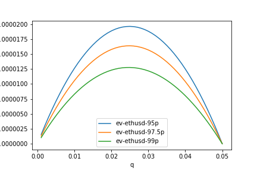
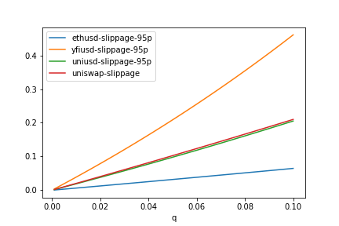
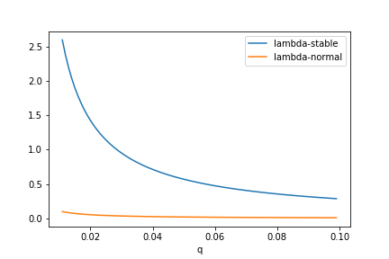

Issue to address with this note:

- Prevent traders from taking advantage of the fact that the TWAP lags the spot price.

## Context

Offering Uniswap TWAPs as markets on Overlay comes with a catch. The TWAP averaged over the previous \\( \Delta \\) blocks only catches up to changes in the spot price *after the next* \\( \Delta \\) blocks have gone by. This is easily exploitable as a trader, particularly on large jumps in spot.

A trader could wait for a jump to happen on the spot market, realize the direction the TWAP will be going once it catches up to spot over the next \\( \Delta \\) blocks, and scalp an easily assured profit. We've already seen this on [Kovan](https://kovan.overlay.exchange/) with our old contracts.

For example,

displaying 1.5 hours of [simulated data](https://github.com/overlay-market/pystable/blob/main/example/montecarlo.py) generated from fits to ETH-DAI historical price data. The TWAP is averaged over an hour.

The 1h TWAP value immediately after spot jumps from 1983.65 to 1995.48 is still around 1985.86, and the 1h TWAP value an hour after the jump catches up is 2002.48. If we offer the long entry and exit prices at the rolling 1h TWAP value, the scalp trade over an hour yields easy money.

## Responsive Spreads

To prevent traders from taking advantage of the lag, one solution is to add a "bid-ask spread" to the entry and exit values Overlay markets offer to traders. Such a spread should be responsive to large jumps in the most recent spot price while also inheriting the security properties of the TWAP when traders wish to ultimately take profits.

We propose the bid \\( B \\) and ask \\( A \\) prices offered to traders at time \\( t \\) be

\\[ B(t) = \min \bigg[\mathrm{TWAP}(t-\nu, t), \mathrm{TWAP}(t-\Delta, t) \bigg] \cdot e^{-\delta} \\]

\\[ A(t) = \max \bigg[\mathrm{TWAP}(t-\nu, t), \mathrm{TWAP}(t-\Delta, t) \bigg] \cdot e^{\delta}  \\]

where \\( \nu \ll \Delta \\), with an upfront market impact fee burned from staked collateral of

\\[ Q \cdot \bigg[ 1 - e^{-\lambda Q_a} \bigg] \\]

Longs receive the ask as their entry price and the bid as their exit price. Shorts receive the bid as their entry price and the ask as their exit price.

\\( \mathrm{TWAP}(t-\nu, t) \\) is a shorter TWAP used as a proxy for the most recent spot price. Traders unfortunately receive the worst possible price, but it does protect the system both against the predictability of the lag in the longer TWAP *and* [spot price manipulation](#spot-manipulation). Good starting values to average over would be \\( \nu = 40 \\) for a 10m shorter TWAP and \\( \Delta = 240 \\) for a 1h longer TWAP.

\\( \delta \\) is a static spread, on top of the bid-ask TWAP values, used to discourage front-running of the shorter TWAP, which acts as a proxy for spot. Spot values from Uniswap pools shouldn't be used, as they [are vulnerable to manipulation](https://samczsun.com/taking-undercollateralized-loans-for-fun-and-for-profit/).

\\( \lambda Q_a \\) is a market impact term to minimize the damage associated with front-running the TWAP in the event the spot price spikes above the static spread, imposed when new positions are built. \\( Q \\) is the unadjusted open interest for the trade. \\( Q_a \\) is the rolling queued open interest on side \\( a \in \\{ l, s \\} \\) over the last \\( \nu \\) blocks. It should include the trader's proposed \\( Q \\).

Applying a static spread with \\( \delta = 0.00624957 \\) to the 1.5 hours of simulated data plotted above

shows the scalp is no longer profitable over the hour following the jump, as the same long trade now has an entry price at the ask of 1998.31, immediately after the jump, and an exit price at the bid of 1990.01, 1 hour after the jump.

The downside with this approach is we likely reduce the amount of higher frequency trading that occurs on the platform. Over shorter time horizons, it becomes more difficult to exit with a profit, as one has to overcome the spread. For example, examining 6 hours of simulated data

shorting the local top here gives an entry price at the bid of 2489.67 and an exit price at the ask of 2459.50, for a profit (without fees) of 1.21%. Spot on the other hand moved 3% over the same period.

Over longer time horizons, traders can still make significant profits. Looking at 2 days

and 3 months of simulated data

shows markets remain tradeable.

## Calibrating \\( \delta \\)

\\( \delta \\), as an additional static spread, offers protection against large jumps in spot that happen over shorter timeframes than \\( \nu \\). To calibrate, we can use the statistical properties of the underlying feed.

Our goal is to have the static spread \\( e^{\pm \delta} \\) produce bid and ask values that e.x. 99% of the time will be worse than any jumps that are likely to occur in the spot price over a 10 minute interval. This guards against the timelag associated with the shorter 10 minute TWAP versus the actual spot price.

To accomplish this, we suggest setting the spread to

\\[ \delta = \max \bigg[ \delta_l, \delta_s \bigg] \\]

where

$$\begin{eqnarray}
\delta_l &=& \frac{1}{2} F_{X_{\nu}}^{-1}\bigg( F_{X_{\nu}}(g^{-1}(C_p)) - \alpha \bigg) \\
\delta_s &=& - \frac{1}{2} F_{X_{\nu}}^{-1}(\alpha)
\end{eqnarray}$$

such that the value at risk to the system from a trader entering into the TWAP scalp over the next \\( \nu \\) blocks is zero with confidence \\( 1-\alpha \\).

\\( F_{X_{\nu}} \\) and \\( F_{X_{\nu}}^{-1} \\) are, respectively, the CDF and inverse CDF of the [Levy stable](https://en.wikipedia.org/wiki/Stable_distribution) random variable \\( X_{\nu} \sim S(a, b, \mu \nu, \sigma \cdot (\frac{\nu}{a})^{1/a}) \\).

\\( \mu \\), \\( \sigma \\), \\( a \\) and \\( b \\) are parameters expressed per-block above, fit using historical data assuming log-stable increments for the underlying spot price

\\[ P(t+\tau) = P(t) e^{\mu \tau + \sigma L\_{\tau}} \\]

where \\( L\_{\tau} \sim S(a, b, 0, (\frac{\tau}{a})^{1/a}) \\).

\\( C_p \\) is the payoff cap imposed on the position to [limit the damage](note-7) associated with the tails.

\\( g \\) is the uncapped payoff function for the contract

\\[ g(y) = e^{y} - 1 \\]

with inverse

\\[ g^{-1}(c) = \ln(1 + c) \\]

## Calibrating \\( \lambda \\)

\\( \lambda Q \\), as an additional market impact term, offers protection against large jumps in spot that *exceed* our expectations used in calibrating \\( \delta \\). Furthermore, imposing significant market impact (i.e. slippage) on large trades guards the system against traders who have more information than what is currently reflected in the market's current spot price.

Our goal is to have the market impact term \\( e^{\lambda Q} \\) produce bid and ask values that will minimize the expected profits from the scalp in the e.x. 1% of the time *when* spot jumps more than the static spread over a 10 minute interval.

To accomplish this, we suggest setting the market impact parameter to

\\[ \lambda = \max \bigg[ \lambda_l, \lambda_s \bigg] \\]

where

$$\begin{eqnarray}
\lambda_l &=& \frac{1}{Q_0} \cdot \ln \bigg[\frac{\int_0^{g^{-1}(C_p)} dy \; e^{y} f_{Y_{\nu}} (y)}{ [1-F_{Y_{\nu}}(0)] - (1+C_p) \cdot [1-F_{Y_{\nu}} (g^{-1}(C_p))] }\bigg] \\
\lambda_s &=& \frac{1}{Q_0} \cdot \ln \bigg[ 2 - \frac{\int_{-\infty}^{0} dy \; e^{y} f_{Y_{\nu}} (y)}{F_{Y_{\nu}} (0)} \bigg]
\end{eqnarray}$$

such that the expected value (EV) of the PnL for the scalp trade in the case when spot exceeds the spread over the next \\( \nu \\) blocks is less than or equal to zero for \\( Q \geq Q_0 \\).

\\( f_{Y_{\nu}} \\) and \\( F_{Y_{\nu}} \\) are, respectively, the PDF and CDF of \\( Y_{\nu} \sim S(a, b, \mu \nu - 2\delta, \sigma \cdot (\frac{\nu}{a})^{1/a}) \\).

Choices for \\( Q_0 \\) can be framed with respect to a percentage of our market's open interest cap, \\( Q_{max} \\). Governance must choose a value for \\( Q_0 \\) that balances EV risks from the scalp trade vs platform usability risks due to severe slippage. We give suggested values with concrete numbers below.

### Implementation

It is likely easier to target a percentage of our open interest caps vs a nominal open interest amount. Normalize with respect to our open interest cap, \\( Q_{max} \\), such that

\\[ \tilde{\lambda} \equiv \lambda \cdot Q_{max} \\]

\\[ q \equiv \frac{Q}{Q_{max}} \\]

Market impact can then be calculated based off of how much of the allowed open interest the queued open interest will ultimately occupy upon settlement:

\\[ e^{\tilde{\lambda} \cdot q} \\]

with slippage curves we can compare to other AMMs over the open interest range we support, \\( q \in [0, 1] \\).

Further, the manner in which we enforce market impact is important. If we choose to adjust bid/ask values for market impact, we either ruin the fungibility of position shares (ERC-1155) or have traders not know what their exact slippage will be until the next oracle fetch occurs. The latter is terrible UX as a whale could come in after a small fish in the same update period and cause slippage for the small fish to be massive.

Alternatively, imposing market impact as an upfront fee burned from staked collateral when users build their positions maintains fungibility of the position shares and does not burn small fish.

## Concrete Numbers

### USDC-WETH SushiSwap Pool

We use [`pystable`](https://github.com/overlay-market/pystable) to fit 120 days of 10 minute data on the [USDC-WETH SushiSwap pool](https://analytics.sushi.com/pairs/0x397ff1542f962076d0bfe58ea045ffa2d347aca0), from timestamp `1618868463` (April 19, 2021) to `1626472862` (July 16, 2021).

Assuming 15 second blocks, per-block parameter values obtained are `a = 1.4029884974837792`, `b = -0.008110504596997956`, `mu = -1.4909873693826263e-07`, `sig = 0.00012610528857189945`. Take the payoff cap to be \\( C_p = 4 \\) for a max PnL of 400% (5x payoff).

For 99% confidence (`alpha = 0.01`), we have `delta = 0.0068548970717639225`. This is a spread of about 65 bps on either side of the TWAP (1.4% total).

Requiring negative EV on the scalp for position sizes greater than \\( q_0 = 0.03 \\) (3% of the OI cap), yields a normalized `lambda = 1.076380317981746`. This amounts to about 1.08% slippage for every 1% of OI cap taken with smaller position sizes.

### ETH/USD FTX Spot Market

The prior TWAP fits can be slightly misleading since they are taken with respect to 1h TWAP data, which won't be the same as fits to spot.

We use `pystable` again to fit 600 days of 1 minute data on the [ETH/USD spot market](https://ftx.com/en/trade/ETH/USD), from timestamp `1577836800` (December 31, 2019) to `1629729120` (August 8, 2021).

Assuming 15 second blocks, per-block parameter values obtained are `a = 1.3323780695989331`, `b = 0.028298587221832504`, `mu = 5.439488998979958e-06`, `sig = 0.00023820339727490902`. Take the payoff cap to be \\( C_p = 4 \\) for a max PnL of 400% (5x payoff).

For 99% confidence (`alpha = 0.01`), we have a much larger `delta = 0.01772033390453983`. At the 95% confidence level (`alpha = 0.05`), we have a tradeable value of `delta = 0.005725031958894104`. The latter is a spread of about 57 bps on either side of the TWAP (1.14% total).

The following table provides a list of \\( \delta \\) values for different confidence levels \\( \alpha \\)

| \\(\alpha \\) | \\(\delta \\) |
| --- | ----- |
| 0.01 | 0.0177 |
| 0.025 | 0.00923 |
| 0.05 | 0.00573 |
| 0.075 | 0.00434 |
| 0.1 | 0.00354 |

Similarly, for various \\( (\alpha, q_0) \\) combinations, we have \\( \tilde{\lambda} \\) values

| \\( \alpha, q_0 \\) | 0.01 | 0.02 | 0.03 | 0.04 | 0.05 | 0.06 | 0.07 |
| 0.01 | 10.204 | 5.102 | 3.401 | 2.551 | 2.041 | 1.701 | 1.458 |
| 0.025 | 5.228 | 2.614 | 1.743 | 1.307 | 1.046 | 0.871 | 0.747 |
| 0.05 | 3.132 | 1.566 | 1.044 | 0.783 | 0.626 | 0.522 | 0.447 |
| 0.075 | 2.323 | 1.162 | 0.774 | 0.581 | 0.465 | 0.387 | 0.332 |
| 0.10 | 1.884 | 0.942 | 0.628 | 0.471 | 0.377 | 0.314 | 0.269 |

We can compare the expected amount of the OI cap we lose to traders versus the typical position size the trader takes. Plotting \\( \alpha \cdot \mathbb{E}[ \mathrm{PnL} \| \mathrm{PnL}_{\lambda = 0} > 0 ] \\) in the range where the trader expects +EV, \\( q \in [0, q_0] \\),

shows the more uncertainty we allow in \\( \alpha \\), the more we should expect to lose to scalpers.

Choosing \\( q_0 = 0.05 \\) and \\( \alpha = 0.05 \\), yield tradeable values for our ETH-DAI market of \\( (\delta, \tilde{\lambda} ) = (0.00573, 0.626) \\). Static spread amounts to 57 bps. Slippage amounts to about 63 bps for every 1% of the OI cap.

Comparing our slippage values when fiting FTX ETH/USD, UNI/USD, and YFI/USD prices vs Uniswap V2 slippage (\\( q = \frac{\delta x}{x} \\))

shows feeds with much heavier tails require far more slippage as protection. Our ETH-DAI fit beats out Uni V2 over the range of interest if our OI cap choice is close to the underlying liquidity in the spot pool.

Backtesting against the last year of FTX historical data for ETH/USD, UNI/USD, YFI/USD, and ALCX/USD, one finds the protocol's losses to the scalp trader would be minimal with our bid/ask spread implementation. In fact, the trader often loses substantially, particularly on the short scalp (approximately -10% of OI cap over 1-1.5 years). Refer to the end of [this Jupyter notebook](https://github.com/overlay-market/OIPs/blob/master/_notebooks/oip-1/note-8.ipynb) for ETH/USD.

### Replication

Console logs to replicate above are in [this gist](https://gist.github.com/mikeyrf/b8202b738b2f594f87e81cdc3bd5a41c#file-spread-calc-md).

Script to fetch SushiSwap pool data is [here](https://github.com/overlay-market/overlay-risk/blob/main/scripts/influx_sushi.py), with TWAP calculation in this [notebook](https://github.com/overlay-market/OIPs/blob/master/_notebooks/oip-1/note-7.ipynb). Script to fetch FTX data is [here](https://github.com/overlay-market/OIPs/blob/master/_notebooks/oip-1/scripts/fetch_ohlcv.py).

## Deriving \\( \delta \\)

Formally, the maximum attainable profit after \\( \nu \\) blocks, \\( \mathrm{VaR}(\alpha, \nu) \\), from the long scalp trade is given by

$$\begin{eqnarray}
1-\alpha &=& \mathbb{P}[ \mathrm{PnL}(Q, t+\nu) \leq \mathrm{VaR}(\alpha, \nu) | \mathcal{F}_{t-\nu} ] \\
&\approx& \mathbb{P}\bigg[ Q \cdot \bigg( \frac{P(t)}{P(t-\nu)} e^{-2\delta_l - \lambda Q} - 1 \bigg) \leq \mathrm{VaR}(\alpha, \nu) | \mathcal{F}_{t-\nu} \bigg] \\
&=& \mathbb{P}\bigg[ Q \cdot \bigg( e^{\mu \nu + \sigma L_{\nu} -2\delta_l - \lambda Q} - 1 \bigg) \leq \mathrm{VaR}(\alpha, \nu) \bigg]
\end{eqnarray}$$

assuming confidence \\( 1-\alpha \\), where \\( Q \\) is the long open interest taken out by the trader. Our market contracts can only rely on stale information from the oracle feed before the current time \\( t \\): \\( \mathcal{F}_{t-\nu} \\).

We've made simplifying assumptions by having our entry and exit TWAP values

- \\( \mathrm{TWAP}(t, t+\nu) \sim \mathrm{TWAP}(t, t+\Delta) \sim P(t) \\)
- \\( \mathrm{TWAP}(t-\nu, t) \sim P(t-\nu) \\)

take similar values to the spot price \\( \nu \\) blocks in the past. To understand why, reference our first plot in [responsive spreads](#responsive-spreads):

- Jump occurs at t=195250
- Spot at t=195250 jumps from 1985 to ~2000
- 10m TWAP at t=195250 remains in line with spot 10m prior (before jump)
- 10m TWAP at t=195290 (40 blocks or 10m after jump) finally catches up with the spot value at t=195250

The value at risk due to this long scalp is then

\\[ \mathrm{VaR}(\alpha, \nu) = Q \cdot \bigg[ e^{\mu \nu + \sigma \cdot (\frac{\nu}{a})^{1/a} F^{-1}_{ab}(1-\alpha) - 2\delta_l - \lambda Q } - 1 \bigg] \\]

which is equal to zero when

\\[ \delta_l = \frac{1}{2} \bigg[ \mu \nu + \sigma \cdot \bigg( \frac{\nu}{a} \bigg)^{1/a} F^{-1}_{ab}(1-\alpha) \bigg] \\]

regardless of market impact on entry, \\( \lambda Q \\).

Proceeding through similar logic for the short scalp before considering market impact

$$\begin{eqnarray}
1-\alpha &=& \mathbb{P}[ \mathrm{PnL}(Q, t+\nu) \leq \mathrm{VaR}(\alpha, \nu) | \mathcal{F}_{t-\nu} ] \\
&\approx& \mathbb{P}\bigg[ Q \cdot \bigg( 1 - e^{\mu \nu + \sigma L_{\nu} + 2\delta_s} \bigg) \leq \mathrm{VaR}(\alpha, \nu) | \mathcal{F}_{t-\nu} \bigg]
\end{eqnarray}$$

gives a VaR equal to zero when

\\[ \delta_s = \frac{1}{2} \bigg[ -\mu \nu - \sigma \cdot \bigg( \frac{\nu}{a} \bigg)^{1/a} + \sigma \cdot \bigg(\frac{\nu}{a}\bigg)^{1/a} F^{-1}_{ab}(1-\alpha) \bigg] \\]

Setting our static spread \\( \delta \\) to this expression implies that, with confidence \\( 1-\alpha \\), the value at risk to the system after the next \\( \nu \\) blocks from front-running the shorter TWAP will be at most zero, once the TWAP catches up to spot.

## Deriving \\( \lambda \\)

We want to minimize the expected value of the trader's PnL from the scalp, assuming the PnL would be > 0 without imposing market impact on the trade (i.e. spot has spiked beyond the static spread). Formally, the expected value conditioned on the scalp trade being profitable without market impact is given by

$$\begin{eqnarray}
\mathbb{E} \bigg[ \mathrm{PnL} (Q, t+\nu) | \mathrm{PnL}_{\lambda = 0} > 0 \bigg] &\approx& \mathbb{E} \bigg[ Q e^{- \lambda Q} \cdot \bigg( e^{Y_{\nu}} - 1 \bigg) - Q \cdot \bigg( 1 - e^{- \lambda Q} \bigg) | Y_{\nu} > 0 \bigg] \\
&=& \mathbb{E} \bigg[ Q \cdot \bigg( e^{Y_{\nu} - \lambda Q} - 1 \bigg) | Y_{\nu} > 0 \bigg] \\
&=& \frac{Q \int_0^{\infty} dy \; f_{Y_{\nu}} (y) \cdot [e^{y - \lambda Q} - 1]}{\int_0^{\infty} dy \; f_{Y_{\nu}} (y)} \\
&=& Q \cdot \bigg[\frac{e^{- \lambda Q} \int_0^{\infty} dy \; e^{y} f_{Y_{\nu}} (y)}{\int_0^{\infty} dy \; f_{Y_{\nu}} (y)} - 1\bigg] \\
&=& Q \cdot \bigg[e^{h - \lambda Q} - 1\bigg]
\end{eqnarray}$$

where

\\[ h = \ln \bigg[\frac{\int_0^{\infty} dy \; e^{y} f_{Y_{\nu}} (y)}{\int_0^{\infty} dy \; f_{Y_{\nu}} (y)}\bigg] \\]

\\[ Y_{\nu} \equiv \mu \nu - 2\delta + \sigma L_{\nu} \\]

and \\( f_{Y_{\nu}} \\) is the PDF of \\( Y_{\nu} \sim S(a, b, \mu \nu - 2\delta, \sigma \cdot (\frac{\nu}{a})^{1/a}) \\).

The conditional expected value is then less than or equal to zero,

\\[ \mathbb{E} \bigg[ \mathrm{PnL} (Q, t+\nu) \| \mathrm{PnL}_{\lambda = 0} > 0 \bigg] \leq 0 \\]

when

\\[ \lambda Q \geq h \\]

If we target a particular \\( Q_0 \\) beyond which the trade is negative EV, our market impact parameter will be

\\[ \lambda = \frac{1}{Q_0} \cdot \ln \bigg[\frac{\int_0^{\infty} dy \; e^{y} f_{Y_{\nu}} (y)}{\int_0^{\infty} dy \; f_{Y_{\nu}} (y)}\bigg] \\]

where \\( Q \geq Q_0 \\) has an unprofitable expected value even when spot spikes beyond the static spread.

For anything other than \\( a = 2 \\) (Gaussian), the top integral will be undefined since the \\( p \\) moment of a stable distribution [is infinite](https://cpb-us-w2.wpmucdn.com/sites.coecis.cornell.edu/dist/9/287/files/2019/08/Nolan-9-Nolan_Financial-Modeling-w-heavy-tailed-stable-2.pdf) when \\( p \geq a \\). This can be resolved with caps on the payoff function, which [cuts off the impact](#note-7) from the power law tails of the distribution. We'll rely on an imposed payoff cap to extend to the non-normal case.

Let

\\[ g(y) \equiv e^{y} - 1 \\]

with capped payoff function for the position given by

\\[ \mathrm{PnL}(Q, t+\nu) = Q \cdot \min \bigg( g(Y_{\nu} - \lambda Q), C_p \bigg) \\]

and inverse

\\[ g^{-1}(c) \equiv \ln(1 + c) \\]

assuming \\( C_p \gg 2 \delta \\). Returning to the conditional expected value and proceeding through the same exercise changes our expression to

$$\begin{eqnarray}
\mathbb{E} \bigg[ \mathrm{PnL} (Q, t+\nu) | \mathrm{PnL}_{\lambda = 0} > 0 \bigg] \\
\approx \mathbb{E} \bigg[ Q \cdot \min \bigg( g(Y_{\nu} - \lambda Q), C_p \bigg) | Y_{\nu} > 0 \bigg] \\
= \frac{Q \cdot [\int_0^{g^{-1}(C_p) + \lambda Q} dy \; f_{Y_{\nu}} (y) \cdot g(y-\lambda Q) + C_p \int_{g^{-1}(C_p) + \lambda Q}^{\infty} dy \; f_{Y_{\nu}} (y) ] }{\int_0^{\infty} dy \; f_{Y_{\nu}} (y)} \\
\leq \frac{Q \cdot [\int_0^{g^{-1}(C_p)} dy \; f_{Y_{\nu}} (y) \cdot g(y-\lambda Q) + C_p \int_{g^{-1}(C_p)}^{\infty} dy \; f_{Y_{\nu}} (y) ] }{\int_0^{\infty} dy \; f_{Y_{\nu}} (y)} \\
= \frac{Q}{1-F_{Y_{\nu}} (0)} \cdot \bigg[ \int_0^{g^{-1}(C_p)} dy \; f_{Y_{\nu}} (y) \cdot (e^{y - \lambda Q} - 1) + C_p \cdot [1 - F_{Y_{\nu}} (g^{-1}(C_p))] \bigg] \\
= Q \cdot \bigg[ e^{h - \lambda Q} - 1 + (1+C_p) \cdot \frac{1 - F_{Y_{\nu}} (g^{-1}(C_p))}{1-F_{Y_{\nu}} (0)} \bigg]
\end{eqnarray}$$

\\( h \\) gets capped

\\[ h = \ln \bigg[\frac{\int_0^{g^{-1}(C_p)} dy \; e^{y} f_{Y_{\nu}} (y)}{\int_0^{\infty} dy \; f_{Y_{\nu}} (y)}\bigg] \\]

and the integral in the numerator becomes finite. The market impact parameter that produces negative EV for the scalp when \\( Q > Q_0 \\) is now

\\[ \lambda = \frac{1}{Q_0} \cdot \ln \bigg[\frac{\int_0^{g^{-1}(C_p)} dy \; e^{y} f_{Y_{\nu}} (y)}{ [1-F_{Y_{\nu}}(0)] - (1+C_p) \cdot [1-F_{Y_{\nu}} (g^{-1}(C_p))] }\bigg] \\]

which reduces to our original expression when \\( C_p \to \infty \\). Note that \\( 1 - F_{Y\_{\nu}}(0) = \alpha \\).

We can use numerical integration for the numerator to obtain our parameter value.

### Gaussian Case

It is still instructive however to examine the Gaussian case (\\( a=2 \\)), which gives a simple closed form solution. Assume \\( C_p \to \infty \\), so no caps.

Integrals simplify to

\\[ \int_0^{\infty} dy \; f_{Y_{\nu}}(y) = 1 - \Phi \bigg(\frac{2\delta-\mu \nu}{\sigma \sqrt{\nu}} \bigg) \\]

\\[ \int_0^{\infty} dy \; e^{y} f_{Y_{\nu}}(y) = e^{\mu \nu - 2\delta + \frac{\sigma^2 \nu}{2}} \cdot \bigg[ 1 - \Phi \bigg( \frac{2\delta - \mu \nu}{\sigma \sqrt{\nu}} - \sigma \sqrt{\nu} \bigg) \bigg] \\]

where \\( \Phi \\) is the CDF of the standard normal \\( \mathcal{N}(0, 1) \\). Market impact parameter will simplify to

\\[ \lambda = \frac{1}{Q_0} \cdot \bigg[ \mu\nu - 2\delta + \frac{\sigma^2 \nu}{2} + \ln \rho \bigg] \\]

where

\\[ \rho \equiv \frac{1 - \Phi \bigg( \frac{2\delta - \mu \nu}{\sigma \sqrt{\nu}} - \sigma \sqrt{\nu} \bigg)}{1 - \Phi \bigg(\frac{2\delta-\mu \nu}{\sigma \sqrt{\nu}} \bigg)} \\]

Note that for the [Wiener process](https://en.wikipedia.org/wiki/Wiener_process), the moment generating function is finite and known. The unconditioned form of our expression of interest reduces to

\\[ \mathbb{E}[e^{\mu\nu - 2\delta + \sigma W_{\nu}}] = e^{\mu \nu - 2\delta + \frac{\sigma^2 \nu}{2}} \\]

showing from a different angle where our terms in \\( \lambda \\), sans \\( \ln \rho \\), come from.

Though the difference between \\( \lambda \\) values for log-normal vs log-stable increments is drastic, due to the tail condition we calibrate off of.

At negative EV for the scalp trade above 2% of the open interest cap as our target for \\( Q_0 \\) (\\( q = 0.02 \\)), there's a ~25x difference between required \\( \lambda \\) values for log-normal and log-stable fits. Meaning, slippage needs to be 25x worse for the log-stable fit to accurately reflect the negative EV condition we want.

## Spot Manipulation

Uniswap offers the TWAP as a method for offering a [manipulation-resistant on-chain oracle](https://uniswap.org/whitepaper-v3.pdf). There are two scenarios to be wary of with our bid-ask approach:

1. Spot jumps and a trader manipulates the pool back to the original price to minimize the spread and effectively obtain the scalp profit.

2. Over several blocks, a trader swaps through a spot feed we support into OVL and uses the proceeds to immediately enter trades on the feed's associated Overlay market, before the shorter TWAP can catch up to the spot move.

For the first scenario, the cost of manipulation is limited to the amount spot *actually* jumps within \\( \nu \\) blocks. Once a real jump occurs, the attacker suppresses the price back to the lagging TWAP value over the following \\( \nu \\) blocks, as they know the scalp will be profitable over the next \\( \Delta \\) blocks once the attack is over, spot recalibrates to the jump, and they've locked in their entry for the scalp.

We can adapt work from a [prior note](note-2) here. Assume spot actually jumps \\( \| r \| \gg \delta \\), such that \\( P(1) = P(0) \cdot (1 + r) \\). Over the next \\( \nu \\) blocks, the attacker will need

$$
\begin{eqnarray}
\mathrm{TC}|_{B} (\epsilon) =
\begin{cases}
y \cdot \nu \cdot \bigg( \frac{1}{L \cdot | \epsilon |} + 1 \bigg) \bigg[ \frac{1}{\sqrt{1 - | \epsilon |}} - 1 \bigg] & -|r| < \epsilon < -\delta, \; r < 0 \\
x \cdot \nu \cdot \bigg( \frac{1}{L \cdot \epsilon} + 1 \bigg) \bigg[ \sqrt{1 + \epsilon} - 1 \bigg] & \delta < \epsilon < r, \; r > 0
\end{cases}
\end{eqnarray}
$$

in capital to manipulate the entry TWAP price back an amount \\( \epsilon \leq r \\) to break-even on the scalp and secure a spread of \\( \epsilon \\). \\( L \\) is the leverage they use on the scalp. \\( x \\) and \\( y \\) are the X and Y token liquidity in the spot pool, respectively.

At a minimum, the attacker will need

\\[ \lim_{\epsilon \to 0} \mathrm{TC}\|_{B} (\epsilon) = \frac{x}{2} \cdot \frac{\nu}{L} = \frac{y}{2} \cdot \frac{\nu}{L} \\]

to execute the scalp trade profitably in scenario 1. Assuming parameters:

- \\( \nu = 40 \\): for a shorter 10 minute TWAP
- \\( x = y = \mathrm{$10M} \\): for a spot pool with liquidity of $20M
- \\( L = 5 \\): for maximum leverage of 5x

The minimum cost of attack comes out to $80M, entered directly into the Overlay market as collateral for the trade. Constraints on market impact \\( \lambda \\) required by the second scenario will make this unprofitable, as we'll show below.

For the second scenario, the capital used to manipulate the spot market is put to use as collateral for the Overlay market leg of the attack. For instance, say we offer ETH-DAI as an Overlay market. The attacker would swap a significant amount of DAI routed through DAI \\( \to \\) ETH \\( \to \\) OVL on Uniswap, then send the output OVL into a long on the ETH-DAI Overlay market to immediately front-run the known change to the \\( \mathrm{TWAP}(t-\nu, t) \\) value.

Therefore, unlike the first scenario, there really isn't a sunk cost to producing this attack, as long as all of the capital swapped on Uniswap is used as collateral for the trade on Overlay. Market impact ultimately saves us here. Say the attacker takes out \\( Q = L \cdot \delta x \\) worth of long open interest on Overlay immediately after the spot swap to bump up the price. \\( L \\) is the leverage used and \\( \delta x \\) is the capital swapped for on spot.

The capital \\( \delta x \\) required to bump the Uniswap spot price up by \\( 0 < \epsilon < \infty \\) is

\\[ \delta x = x \bigg[ \sqrt{1 + \epsilon} - 1 \bigg] \\]

where \\( x \\) is the X token liquidity for the spot pool. Roughly, the PnL obtained on the Overlay leg of the attack will be

\\[ \mathrm{PnL} = Q \cdot \bigg[ e^{-\lambda Q} \cdot (1 + \epsilon) - 1 \bigg] \\]

assuming a worst case scenario of no arbitrageurs bringing the spot pool back in line within \\( \Delta \\) blocks. This is unrealistic, but should give us conservative bounds on \\( \lambda \\).

For this attack to be unprofitable, \\( \mathrm{PnL} \leq 0 \\), slippage must be stricter than

\\[ \tilde{\lambda} \geq \frac{Q_{max}}{Lx} \cdot \frac{\ln (1 + \epsilon)}{\sqrt{1+\epsilon}-1} \\]

assuming an open interest cap of \\( Q_{max} \\) on the market. The right hand side is at its maximum when \\( L = 1 \\) and \\( \epsilon \to 0 \\), with \\( \lim_{\epsilon \to 0} \frac{\ln (1+\epsilon)}{\sqrt{1+\epsilon}-1} = 2 \\). This implies a simple relationship for the minimum slippage required on the Overlay market when referencing a Uniswap spot pool. However, given we calibrate \\( \tilde{\lambda} \\) based off the statistical properties of the feed, we can think of this relation instead as a bound on the OI cap. Therefore, we must require

\\[ Q_{max} \leq \frac{\tilde{\lambda} x}{2} \\]

to make the attack from the second scenario unprofitable. The same results are obtained for the attacker looking to short: \\( Q_{max} \leq \frac{\tilde{\lambda} y}{2} \\).

Approximating from current [ETH-DAI Uniswap V3 stats](https://info.uniswap.org/#/pools/0xc2e9f25be6257c210d7adf0d4cd6e3e881ba25f8), take \\( x \\) to be about $35M. We use a \\( \tilde{\lambda} \\) value of 0.627 from our earlier fits to FTX ETH/USD data. This suggests a bound on the OI cap, \\( Q_{max} \\), for our ETH-DAI market of $10.973M. Markets with much higher slippage (e.x. YFI-USD would yield \\( \tilde{\lambda} \\) about 6x larger at 3.790) will tend to be less prone to this type of attack -- the bound on OI cap will be less strict to mitigate the second scenario.

## Considerations

Given we calibrate \\( \delta \\) and \\( \lambda \\) based off of the statistical properties of the underlying feed, these results should generalize beyond TWAPs to any oracle feed that experiences some form of time delay, \\( \nu \\), with respect to the oracle's "actual" most recent value.
