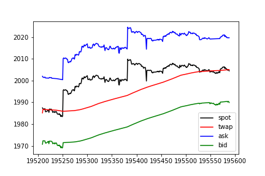

Issue to address with this note:

- Prevent traders from taking advantage of the fact that the TWAP is a lagging indicator of the spot price.

## Context

Offering Uniswap TWAPs as markets on Overlay comes with a catch. The TWAP averaged over the previous \\( \Delta \\) blocks only catches up to changes in the spot price *after the next* \\( \Delta \\) blocks have gone by. This is easily exploitable as a trader, particularly on large jumps in spot.

A trader could wait for a jump to happen on the spot market, realize the direction the TWAP will be going once it catches up to spot over the next \\( \Delta \\) blocks, and scalp an easily assured profit. We've already seen this on [Kovan](https://kovan.overlay.exchange/) with our old contracts. For example,

using simulated data generated from fits to ETH-DAI historical price data.

To prevent traders from taking advantage of the lag, one solution is to add a "bid-ask spread" to the entry and exit values Overlay markets offer to traders. Such a spread should be responsive to large jumps in the most recent spot price while also inheriting the security properties of the TWAP when traders wish to ultimately take profits.

## Responsive Spreads

