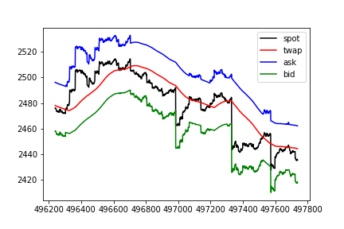

Issue to address with this note:

- Prevent traders from taking advantage of the fact that the TWAP is a lagging indicator of the spot price.

## Context

Offering Uniswap TWAPs as markets on Overlay comes with a catch. The TWAP averaged over the previous \\( \Delta \\) blocks only catches up to changes in the spot price *after the next* \\( \Delta \\) blocks have gone by. This is easily exploitable as a trader, particularly on large jumps in spot.

A trader could wait for a jump to happen on the spot market, realize the direction the TWAP will be going once it catches up to spot over the next \\( \Delta \\) blocks, and scalp an easily assured profit. We've already seen this on [Kovan](https://kovan.overlay.exchange/) with our old contracts.

For example,

displaying 1.5 hours of [simulated data](https://github.com/overlay-market/pystable/blob/main/example/montecarlo.py) generated from fits to ETH-DAI historical price data. The TWAP is averaged over an hour.

The 1h TWAP value immediately after spot jumps from 1983.65 to 1995.48 is still around 1985.86, and the 1h TWAP value an hour after the jump catches up is 2002.48. If we offer the long entry and exit prices at the rolling 1h TWAP value, the scalp trade over an hour yields easy money.

## Responsive Spreads

To prevent traders from taking advantage of the lag, one solution is to add a "bid-ask spread" to the entry and exit values Overlay markets offer to traders. Such a spread should be responsive to large jumps in the most recent spot price while also inheriting the security properties of the TWAP when traders wish to ultimately take profits.

We propose the bid \\( B(t) \\) and ask \\( A(t) \\) prices offered to traders at time \\( t \\) be

\\[ B(t) = \min \bigg(P(t), \mathrm{TWAP}(t-\Delta, t) \bigg) \cdot e^{-\epsilon_s} \\]

\\[ A(t) = \max \bigg(P(t), \mathrm{TWAP}(t-\Delta, t) \bigg) \cdot e^{\epsilon_s}  \\]

Longs receive the ask as their entry price and the bid as their exit price. Shorts receive the bid as their entry price and the ask as their exit price.

Traders unfortunately receive the worst possible price, but it does protect the system both against the predictability of the TWAP lag *and* [spot price manipulation](#spot-manipulation).

\\( \epsilon_s \\) is an additional spread added, regardless of the current spot price, to encourage longer term trading. This helps guard against traders who may have significantly more information than what everyone else has before that information is reflected in the spot price.

Applying a spread with \\( \epsilon_s = 0.00728 \\) to the 1.5 hours of simulated data plotted above

shows the scalp is no longer profitable over the hour following the jump, as the same long trade now has an entry price at the ask of 2010.07, immediately after the jump, and an exit price at the bid of 1987.95, 1 hour after the jump.

The downside with this approach is we likely reduce the amount of higher frequency trading that occurs on the platform. Over shorter time horizons, it becomes more difficult to exit with a profit, as one has to overcome the spread. For example, examining 6 hours of simulated data

it's clear that shorting the local top here gives an entry price at the bid of 2477.91 and an exit price at the ask of 2461.99, for a profit (without fees) of 0.64%. Spot on the other hand moved 3% over the same period.

Over much longer time horizons, traders can still make significant profits. Looking at 3 months of simulated data

shows markets remain tradeable.

## Spot Manipulation

Uniswap offers the TWAP as a method for offering a [manipulation-resistant on-chain oracle](https://uniswap.org/whitepaper.pdf). However, we're suggesting using *both* the TWAP and the current spot price to determine what entry and exit prices to give traders. At first glance, [this is rather concerning](https://samczsun.com/taking-undercollateralized-loans-for-fun-and-for-profit/).

Are Overlay markets now susceptible to manipulation of the spot price?

Take the example of an attacker manipulating the spot price upward. In another round of sims, we add a shock of ~10% over 100 blocks

to use as an example.

**Q: Are we comparing the rate against known good rates as samczsun suggests? There's an attack potentially with spot manipulation**

*NOTE: There is a possible attack on others positions: user manipulates the spot price to cause other user's queued OI to settle at a worse price than they would have had otherwise. This grief attack doesn't cause any profit for the user who is causing it however so it's a complete burning of capital. Given liquid spot markets take significant amounts of capital to manipulate, it seems unlikely we should be overly concerned about this griefing attack.*

## Calibrating \\( \epsilon_s \\)

The value of \\( \epsilon_s \\) effectively provides an envelope around the bid-ask spread. Tuning this to be better for higher frequency traders (smaller value) needs to be balanced against the risk associated with traders profiting from information not yet known to the entire market.
